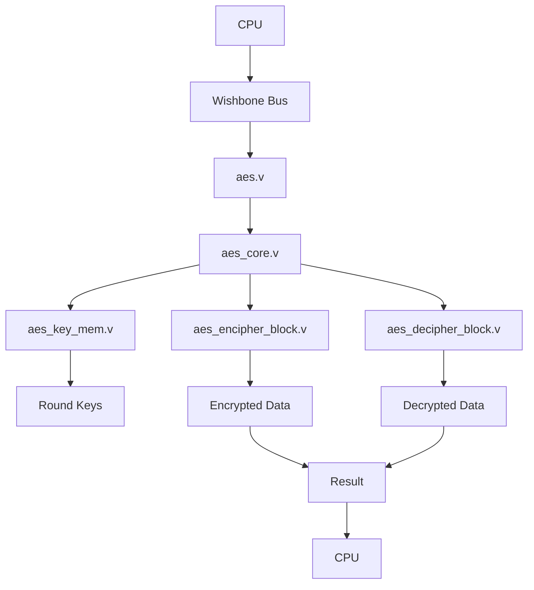

# Step 2 - RTL Design - Thiết Kế RTL

## 📋 Tổng Quan

Tài liệu này mô tả kiến trúc RTL của AES Accelerator, bao gồm các module chính và luồng thực thi CPU cần thiết để giao tiếp với AES core.

---

## 🏗️ Kiến Trúc Tổng Thể

### **Module Hierarchy**
```
aes.v (Top-Level)
├── aes_core.v (Control Logic)
├── aes_key_mem.v (Key Management)
├── aes_encipher_block.v (Encryption)
├── aes_decipher_block.v (Decryption)
├── aes_sbox.v (S-box Lookup)
└── aes_inv_sbox.v (Inverse S-box)
```

### **Data Flow**


---

## 🔧 Các Module Chính

### **1. aes.v - Module Chính**
- **Chức năng**: Top-level module, Wishbone bus interface
- **Ports**: Clock, reset, Wishbone bus signals
- **Memory Map**: Control registers, key registers, data registers
- **Interface**: CPU communication thông qua Wishbone bus

### **2. aes_core.v - Điều Khiển Trung Tâm**
- **Chức năng**: State machine, round control, module coordination
- **States**: IDLE, INIT, NEXT, ERROR
- **Control**: Key expansion, encryption/decryption flow
- **Timing**: Round counter, max rounds (10 cho AES-128, 14 cho AES-256)

### **3. aes_key_mem.v - Quản Lý Khóa**
- **Chức năng**: Key storage, key expansion, round key generation
- **Algorithm**: AES key expansion theo NIST FIPS 197
- **Support**: AES-128 (11 round keys), AES-256 (15 round keys)
- **Features**: S-box integration, Rcon constants

### **4. aes_encipher_block.v - Mã Hóa**
- **Transformations**: SubBytes, ShiftRows, MixColumns, AddRoundKey
- **Galois Field**: gm2, gm3 functions cho MixColumns
- **State Array**: 4x4 byte array management
- **Timing**: 1 round per clock cycle

### **5. aes_decipher_block.v - Giải Mã**
- **Inverse Transformations**: InvSubBytes, InvShiftRows, InvMixColumns, AddRoundKey
- **Inverse Galois Field**: gm9, gm11, gm13, gm14 functions
- **Round Order**: Reverse order so với encryption
- **Verification**: Round-trip testing (encrypt -> decrypt -> original)

---

## 🔄 Luồng Thực Thi CPU

### **Bước 1: Khởi Tạo Khóa**
```verilog
// 1. Ghi khóa vào key registers
CPU_Write(0x10, key[31:0]);    // Key word 0
CPU_Write(0x11, key[63:32]);   // Key word 1
CPU_Write(0x12, key[95:64]);   // Key word 2
CPU_Write(0x13, key[127:96]);  // Key word 3
// Cho AES-256: thêm 4 words nữa

// 2. Cấu hình key length
CPU_Write(0x0A, 0x00);         // 0=AES-128, 1=AES-256

// 3. Kích hoạt key expansion
CPU_Write(0x08, 0x01);         // Set INIT bit
```

### **Bước 2: Cấu Hình Mode**
```verilog
// Chọn encryption hoặc decryption
CPU_Write(0x0A, 0x00);         // 0=Encrypt, 1=Decrypt
```

### **Bước 3: Ghi Dữ Liệu Input**
```verilog
// Ghi plaintext/ciphertext vào data registers
CPU_Write(0x20, data[31:0]);   // Data word 0
CPU_Write(0x21, data[63:32]);  // Data word 1
CPU_Write(0x22, data[95:64]);  // Data word 2
CPU_Write(0x23, data[127:96]); // Data word 3
```

### **Bước 4: Bắt Đầu Xử Lý**
```verilog
// Kích hoạt xử lý
CPU_Write(0x08, 0x02);         // Set NEXT bit
```

### **Bước 5: Chờ Hoàn Thành**
```verilog
// Poll status register
do {
    status = CPU_Read(0x09);
} while (!(status & 0x02));     // Wait for VALID bit
```

### **Bước 6: Đọc Kết Quả**
```verilog
// Đọc kết quả từ result registers
result[31:0] = CPU_Read(0x30);   // Result word 0
result[63:32] = CPU_Read(0x31);  // Result word 1
result[95:64] = CPU_Read(0x32);  // Result word 2
result[127:96] = CPU_Read(0x33); // Result word 3
```

---

## 📊 Memory Map

### **Core Information (Read Only)**
| Địa Chỉ | Tên | Mô Tả |
|----------|------|--------|
| `0x00` | `CORE_NAME0` | Tên core (32 bit thấp) |
| `0x01` | `CORE_NAME1` | Tên core (32 bit cao) |
| `0x02` | `CORE_VERSION` | Phiên bản |

### **Control Register (0x08) - Write/Read**
| Bit | Tên | Mô Tả |
|-----|------|--------|
| 0 | `INIT` | 1 = Khởi tạo khóa |
| 1 | `NEXT` | 1 = Bắt đầu xử lý |

### **Status Register (0x09) - Read Only**
| Bit | Tên | Mô Tả |
|-----|------|--------|
| 0 | `READY` | 1 = Core sẵn sàng |
| 1 | `VALID` | 1 = Kết quả hợp lệ |

### **Configuration Register (0x0A) - Write Only**
| Bit | Tên | Mô Tả |
|-----|------|--------|
| 0 | `ENCDEC` | 0 = Mã hóa, 1 = Giải mã |
| 1 | `KEYLEN` | 0 = 128-bit, 1 = 256-bit |

### **Key Registers (0x10-0x17) - Write Only**
| Địa Chỉ | Tên | Mô Tả |
|----------|------|--------|
| `0x10-0x13` | `KEY[0:3]` | Khóa 128-bit (4 words) |
| `0x14-0x17` | `KEY[4:7]` | Khóa 256-bit (4 words thêm) |

### **Data Registers (0x20-0x23) - Write Only**
| Địa Chỉ | Tên | Mô Tả |
|----------|------|--------|
| `0x20-0x23` | `BLOCK[0:3]` | Dữ liệu input (4 words) |

### **Result Registers (0x30-0x33) - Read Only**
| Địa Chỉ | Tên | Mô Tả |
|----------|------|--------|
| `0x30-0x33` | `RESULT[0:3]` | Kết quả output (4 words) |

---

## ⏱️ Timing và Performance

### **Clock Cycles**
- **Key Expansion**: 1-2 clock cycles
- **Single Round**: 1 clock cycle
- **AES-128**: ~10 clock cycles
- **AES-256**: ~14 clock cycles

### **Latency**
- **Setup Time**: 1 clock cycle
- **Processing Time**: 10-14 clock cycles
- **Total Latency**: 11-15 clock cycles

### **Throughput**
- **AES-128**: 1 block per ~10 clock cycles
- **AES-256**: 1 block per ~14 clock cycles

---

## 🔧 Wishbone Bus Interface

### **Signals**
```verilog
// Clock và Reset
wb_clk_i      // Wishbone clock
wb_rst_i      // Wishbone reset (active low)

// Bus Interface
wbs_stb_i     // Strobe signal
wbs_cyc_i     // Cycle signal
wbs_we_i      // Write enable
wbs_sel_i     // Byte select
wbs_adr_i     // Address bus
wbs_dat_i     // Write data
wbs_dat_o     // Read data
wbs_ack_o     // Acknowledge
```

### **Protocol**
```verilog
// Write Transaction
if (wbs_cyc_i && wbs_stb_i && wbs_we_i) begin
    // Process write
    case (wbs_adr_i)
        8'h08: control_reg <= wbs_dat_i;
        8'h0A: config_reg <= wbs_dat_i;
        8'h10: key_reg[0] <= wbs_dat_i;
        // ... more cases
    endcase
    wbs_ack_o <= 1'b1;
end

// Read Transaction
if (wbs_cyc_i && wbs_stb_i && !wbs_we_i) begin
    // Process read
    case (wbs_adr_i)
        8'h00: wbs_dat_o <= CORE_NAME0;
        8'h09: wbs_dat_o <= status_reg;
        8'h30: wbs_dat_o <= result_reg[0];
        // ... more cases
    endcase
    wbs_ack_o <= 1'b1;
end
```

---

## 🎯 Kết Luận

### **Ưu điểm thiết kế:**
- ✅ **Modular Architecture**: Kiến trúc module rõ ràng, dễ maintain
- ✅ **Standard Compliance**: Tuân thủ chuẩn NIST FIPS 197
- ✅ **Efficient Interface**: Wishbone bus interface chuẩn
- ✅ **Flexible Configuration**: Hỗ trợ cả AES-128 và AES-256

### **Ứng dụng:**
- **Embedded Systems**: Tích hợp vào SoC/FPGA
- **Security Applications**: Bảo mật dữ liệu real-time
- **IoT Devices**: Thiết bị IoT cần mã hóa
- **Caravel Platform**: Tích hợp vào Caravel SoC

### **Lưu ý implementation:**
- Tất cả logic đều synchronous với clock
- Reset logic asynchronous để đảm bảo stability
- Memory map được thiết kế theo chuẩn industry
- Debug capabilities cho development và testing

---

*📝 Tài liệu được cập nhật lần cuối: Tháng 12/2024*
*🔧 Dự án: AES Accelerator trên Caravel Platform*
