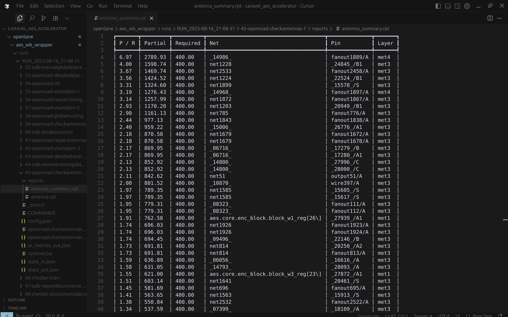
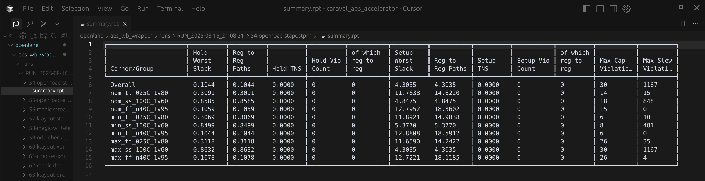
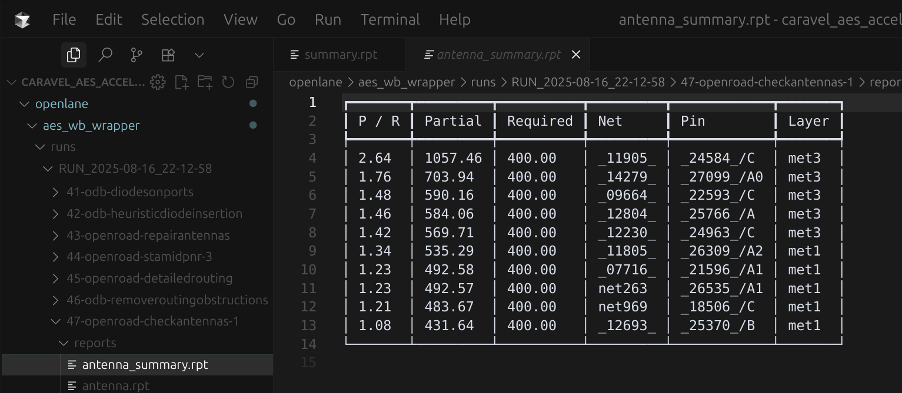
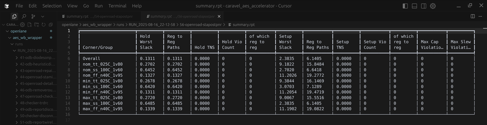
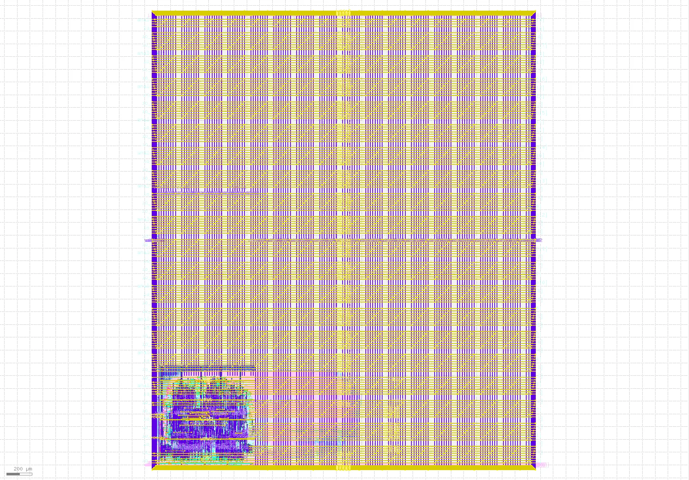

# Step 4 - Openlane2 Flow

## 1. Cài đặt **Nix** và **Openlane2**

Xem hướng dẫn tại đây [Install Nix & Openlane2](https://openlane2.readthedocs.io/en/latest/getting_started/common/nix_installation/installation_linux.html).

## 2. Tạo project từ Caravel template

Tạo 1 repo github từ template của Caravel, tích hợp sẵn bộ công cụ Openlane2 tại [Caravel project](https://github.com/efabless/caravel_user_project_ol2/generate).

Mở terminal, clone repo mới tạo về, ví dụ:
```sh
git clone https://github.com/truong92cdv/caravel_aes_accelerator.git ~/aes
```

## 3. Chuẩn bị file RTL

File RTL thiết kế sẽ được đặt trong thư mục **~/aes/verilog/rtl/**. File **user_project_wrapper.v** là wrapper chứa thiết kế của chúng ta. Bạn cần sửa lại đoạn code *user project is instantiated  here*. Đồng thời copy các file thiết kế của **aes** về cùng thư mục. Bạn có thể copy thủ công hoặc dùng script download tôi đã tạo sẵn:
```sh
curl -s https://raw.githubusercontent.com/truong92cdv/aes/refs/heads/main/script/download.sh ~/download.sh
chmod +x ~/download.sh
~/download.sh https://github.com/truong92cdv/aes/rtl ~/aes/verilog/rtl
```

## 4. Tạo macro AES Wishbone Wrapper với Openlane

Tạo thư mục chứa AES wishbone wrapper
```sh
mkdir -p ~/aes/openlane/aes_wb_wrapper
```

Tạo file **~/aes/openlane/aes_wb_wrapper/config.json** và cấu hình như sau:
```json
{
    "DESIGN_NAME": "aes_wb_wrapper",
    "FP_PDN_MULTILAYER": false,
    "CLOCK_PORT": "wb_clk_i",
    "CLOCK_PERIOD": 25,
    "VERILOG_FILES": [
        "dir::../../verilog/rtl/aes.v",
        "dir::../../verilog/rtl/aes_core.v",
        "dir::../../verilog/rtl/aes_decipher_block.v",
        "dir::../../verilog/rtl/aes_encipher_block.v",
        "dir::../../verilog/rtl/aes_inv_sbox.v",
        "dir::../../verilog/rtl/aes_key_mem.v",
        "dir::../../verilog/rtl/aes_sbox.v",
        "dir::../../verilog/rtl/aes_wb_wrapper.v"
    ],
    "FP_CORE_UTIL": 40
}
```

## 5. Chạy Openlane2 flow cho Macro AES Wishbone Wrapper

Khởi chạy Openlane2 trong môi trường nix-shell, thay đổi đường dẫn theo vị trí cài đặt openlane2 của bạn.
```sh
nix-shell --pure ~/openlane2/shell.nix
```

Chạy flow thiết kế với Openlane2. Hãy đảm bảo bạn đang trong môi trường **nix-shell**
```sh
[nix-shell:~]$ openlane ~/aes/openlane/aes_wb_wrapper/config.json
```
Đợi flow chạy hoàn tất, khoảng 20 phút :(

Mở KLayout xem kết quả

```sh
[nix-shell:~]$ openlane --last-run --flow openinklayout ~/aes/openlane/aes_wb_wrapper/config.json
```


Để nhìn rõ layout như trên hình, bạn cần tắt các layer ***areaid.lowTapDensity*** và ***areaid.standardc*** (double-click vào layer tương ứng trong KLayout).

## 6. Kiểm tra kết quả timing

Khi flow hoàn tất, bạn sẽ thấy 1 folder có dạng **~/aes/openlane/aes_wb_wrapper/runs/RUN_2025-08-16_21-08-31**. Tên folder **RUN_xx** thay đổi theo mỗi lần chạy flow. Đây là folder chứa kết quả chạy Openlane.

### Kiểm tra Antennas
Kiểm tra file **~/aes/openlane/aes_wb_wrapper/runs/RUN_xx/xx-openroad-checkantennas-1/reports/antenna_summary.rpt**. Bạn sẽ thấy rất nhiều lỗi ***antenna violations***:



### Kiểm tra STA
Kiểm tra file **~/aes/openlane/aes_wb_wrapper/runs/RUN_xx/xx-openroad-stapostpnr/summary.rpt**. Kết quả cho thấy không có lỗi ***hold violation*** và ***setup violation***, nhưng có nhiều lỗi ***max cap*** và ***max slew violation***. Trong đó, corner **max_ss_100C_1v60** gây ra nhiều lỗi nhất:



### Kiểm tra DRC

Kiểm tra Magic.DRC tại file **~/aes/openlane/aes_wb_wrapper/runs/RUN_xx/xx-magic-drc/reports/drc_violations.magic.rpt**. Kết quả kiểm tra DRC với Magic không có lỗi.

```
aes_wb_wrapper
----------------------------------------
[INFO] COUNT: 0
[INFO] Should be divided by 3 or 4
```

Kiểm tra KLayout.DRC tại file **~/aes/openlane/aes_wb_wrapper/runs/RUN_xx/xx-klayout-drc/reports/drc_violations.klayout.json**. Kết quả kiểm tra DRC với KLayout không có lỗi (total: 0).

```
{
    ...
    "areaid_re_OFFGRID": 0,
    "total": 0
}
```

### Kiểm tra LVS

Kiểm tra Netgen.LVS tại file **~/aes/openlane/aes_wb_wrapper/runs/RUN_xx/xx-netgen-lvs/reports/lvs.netgen.rpt**. Kết quả kiểm tra LVS với Netgen OK.

```
...
Cell pin lists are equivalent.
Device classes aes_wb_wrapper and aes_wb_wrapper are equivalent.
Final result: Circuits match uniquely.
```

## 7. Khắc phục lỗi

Để fix các lỗi timing trên, cần sửa lại file **~/aes/openlane/aes_wb_wrapper/config.json** như sau:

```json
{
    "DESIGN_NAME": "aes_wb_wrapper",
    "FP_PDN_MULTILAYER": false,
    "CLOCK_PORT": "wb_clk_i",
    "CLOCK_PERIOD": 25,
    "VERILOG_FILES": [
        "dir::../../verilog/rtl/aes.v",
        "dir::../../verilog/rtl/aes_core.v",
        "dir::../../verilog/rtl/aes_decipher_block.v",
        "dir::../../verilog/rtl/aes_encipher_block.v",
        "dir::../../verilog/rtl/aes_inv_sbox.v",
        "dir::../../verilog/rtl/aes_key_mem.v",
        "dir::../../verilog/rtl/aes_sbox.v",
        "dir::../../verilog/rtl/aes_wb_wrapper.v"
    ],
    "FP_CORE_UTIL": 40,
    "GRT_ANTENNA_ITERS": 10,
    "RUN_HEURISTIC_DIODE_INSERTION": true,
    "HEURISTIC_ANTENNA_THRESHOLD": 200,
    "DESIGN_REPAIR_MAX_WIRE_LENGTH": 800,
    "DEFAULT_CORNER": "max_ss_100C_1v60",
    "RUN_POST_GRT_DESIGN_REPAIR": true,
    "PNR_SDC_FILE": "dir::pnr.sdc",
    "SIGNOFF_SDC_FILE": "dir::signoff.sdc"
}
```

Tạo thêm 2 file **~/aes/openlane/aes_wb_wrapper/pnr.sdc** và **~/aes/openlane/aes_wb_wrapper/signoff.sdc**. Copy 2 file tôi đã tạo sẵn về:

```sh
curl -s https://raw.githubusercontent.com/truong92cdv/aes/refs/heads/main/config/pnr.sdc ~/aes/openlane/aes_wb_wrapper/pnr.sdc
curl -s https://raw.githubusercontent.com/truong92cdv/aes/refs/heads/main/config/signoff.sdc ~/aes/openlane/aes_wb_wrapper/signoff.sdc
```

## 8. Chạy lại Openlane2 flow, kiểm tra kết quả timing

```sh
[nix-shell:~]$ openlane ~/aes/openlane/aes_wb_wrapper/config.json
```

Khi flow hoàn tất, bạn sẽ thấy 1 folder **RUN_xx** mới **~/aes/openlane/aes_wb_wrapper/runs/RUN_2025-08-16_22-12-58**. 

### Kiểm tra lại Antennas

Kiểm tra file **~/aes/openlane/aes_wb_wrapper/runs/RUN_xx/xx-openroad-checkantennas-1/reports/antenna_summary.rpt**. Các lỗi ***antenna violations*** giảm đi đáng kể:



### Kiểm tra lại STA

Kiểm tra file **~/aes/openlane/aes_wb_wrapper/runs/RUN_xx/xx-openroad-stapostpnr/summary.rpt**. Tất cả các lỗi STA đã được khắc phục



## 9. Lưu kết quả layout Macro AES wishbone wrapper

```sh
[nix-shell:~]$ bash ~/aes/openlane/copy_views.sh ~/aes aes_wb_wrapper RUN_TAG
```

Thay **RUN_TAG** bằng tên folder **RUN_xx** mới chạy thành công

## 10. Tạo macro User Project Wrapper

User Project Wrapper là macro bên trong chip Caravel dành riêng cho người dùng. Với các cấu hình fixed Floorplan, fixed I/Os pin, fixed power rings không được thay đổi. 
Kiểm tra file **~/aes/openlane/user_project_wrapper/config.json**. Bạn cần sửa đổi đoạn khai báo Macro, thay **user_proj_example** thành **aes_wb_wrapper**. Đặt macro ở vị trí góc dưới trái [10, 20]:

```json
    "MACROS": {
        "aes_wb_wrapper": {
            "gds": [
                "dir::../../gds/aes_wb_wrapper.gds"
            ],
            "lef": [
                "dir::../../lef/aes_wb_wrapper.lef"
            ],
            "instances": {
                "mprj": {
                    "location": [10, 20],
                    "orientation": "N"
                }
            },
            "nl": [
                "dir::../../verilog/gl/aes_wb_wrapper.v"
            ],
            "spef": {
                "min_*": [
                    "dir::../../spef/multicorner/aes_wb_wrapper.min.spef"
                ],
                "nom_*": [
                    "dir::../../spef/multicorner/aes_wb_wrapper.nom.spef"
                ],
                "max_*": [
                    "dir::../../spef/multicorner/aes_wb_wrapper.max.spef"
                ]
            },
            "lib": {
                "*": "dir::../../lib/aes_wb_wrapper.lib"
            }
        }
    },
```

Thay đổi power pins cho phù hợp với power pins của macro

```json
    "PDN_MACRO_CONNECTIONS": ["mprj vccd2 vssd2 VPWR VGND"],
```

Ngoài ra, bạn cần sửa đổi file **~/aes/openlane/aes_wb_wrapper/config.json**, thêm cấu hình **FP_PIN_ORDER_CFG**:

```json
{
    "DESIGN_NAME": "aes_wb_wrapper",
    "FP_PDN_MULTILAYER": false,
    "CLOCK_PORT": "wb_clk_i",
    "CLOCK_PERIOD": 25,
    "VERILOG_FILES": [
        "dir::../../../secworks_aes/src/rtl/aes.v",
        "dir::../../../secworks_aes/src/rtl/aes_core.v",
        "dir::../../../secworks_aes/src/rtl/aes_decipher_block.v",
        "dir::../../../secworks_aes/src/rtl/aes_encipher_block.v",
        "dir::../../../secworks_aes/src/rtl/aes_inv_sbox.v",
        "dir::../../../secworks_aes/src/rtl/aes_key_mem.v",
        "dir::../../../secworks_aes/src/rtl/aes_sbox.v",
        "dir::../../verilog/rtl/aes_wb_wrapper.v"
    ],
    "FP_CORE_UTIL": 40,
    "GRT_ANTENNA_ITERS": 10,
    "RUN_HEURISTIC_DIODE_INSERTION": true,
    "HEURISTIC_ANTENNA_THRESHOLD": 200,
    "DESIGN_REPAIR_MAX_WIRE_LENGTH": 800,
    "DEFAULT_CORNER": "max_ss_100C_1v60",
    "RUN_POST_GRT_DESIGN_REPAIR": true,
    "PNR_SDC_FILE": "dir::pnr.sdc",
    "SIGNOFF_SDC_FILE": "dir::signoff.sdc",
    "FP_PIN_ORDER_CFG": "dir::pin_order.cfg"
}
```

Đồng thời, tạo file **~/aes/openlane/aes_wb_wrapper/pin_order.cfg** có nội dung sau, để đặt các chân pin của aes_wb_wrapper xuống phía dưới:

```
#S
wb_.*
wbs_.*
```

## 11. Chạy lại Openlane flow cho **aes_wb_wrapper**

```sh
[nix-shell:~]$ openlane ~/aes/openlane/aes_wb_wrapper/config.json
```

Kiểm tra lại các reports, lưu kết quả

```sh
[nix-shell:~]$ bash ~/aes/openlane/copy_views.sh ~/aes aes_wb_wrapper RUN_TAG
```

## 12. Chạy Openlane flow cho **user_project_wrapper**

```sh
[nix-shell:~]$ openlane ~/aes/openlane/user_project_wrapper/config.json
```

Mở KLayout xem kết quả

```sh
[nix-shell:~]$ openlane --last-run --flow openinklayout ~/aes/openlane/user_project_wrapper/config.json
```



## 13. Kiểm tra lại kết quả timing, lưu kết quả

Kiểm tra file **~/aes/openlane/user_project_wrapper/runs/RUN_xx/xx-openroad-stapostpnr/summary.rpt**.


