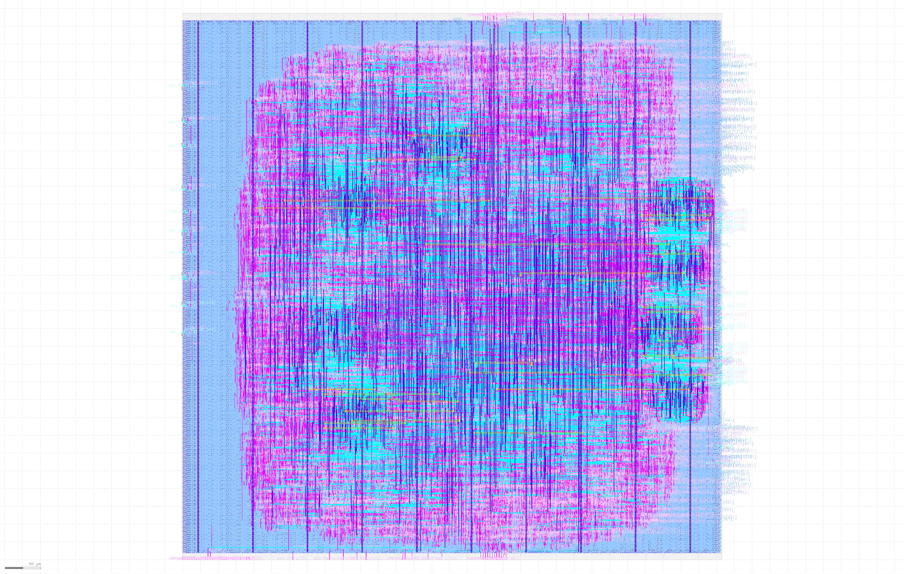

# Step 4 - Setup

## 1. Cài đặt **Nix** và **Openlane2**

## 2. Tạo project từ Caravel template

Tạo 1 repo github từ template của Caravel, tích hợp sẵn bộ công cụ Openlane2 tại [Caravel project](https://github.com/efabless/caravel_user_project_ol2/generate).

Mở terminal, clone repo mới tạo về, ví dụ:
```sh
git clone https://github.com/truong92cdv/caravel_aes_accelerator.git ~/aes
```

## 3. Chuẩn bị file RTL

File RTL thiết kế sẽ được đặt trong thư mục **~/aes/verilog/rtl/**. File **user_project_wrapper.v** là wrapper chứa thiết kế của chúng ta. Bạn cần sửa lại đoạn code *user project is instantiated  here*. Đồng thời copy các file thiết kế của **aes** về cùng thư mục. Bạn có thể copy thủ công hoặc dùng script download tôi đã tạo sẵn:
```sh
curl -s https://raw.githubusercontent.com/truong92cdv/aes/refs/heads/main/script/download.sh ~/download.sh
chmod +x ~/download.sh
~/download.sh https://github.com/truong92cdv/aes/rtl ~/aes/verilog/rtl
```

## 4. Tạo macro AES Wishbone Wrapper với Openlane

Tạo thư mục chứa AES wishbone wrapper
```sh
mkdir -p ~/aes/openlane/aes_wb_wrapper
```

Tạo file **~/aes/openlane/aes_wb_wrapper/config.json** và cấu hình như sau:
```json
{
    "DESIGN_NAME": "aes_wb_wrapper",
    "FP_PDN_MULTILAYER": false,
    "CLOCK_PORT": "wb_clk_i",
    "CLOCK_PERIOD": 25,
    "VERILOG_FILES": [
        "dir::../../verilog/rtl/aes.v",
        "dir::../../verilog/rtl/aes_core.v",
        "dir::../../verilog/rtl/aes_decipher_block.v",
        "dir::../../verilog/rtl/aes_encipher_block.v",
        "dir::../../verilog/rtl/aes_inv_sbox.v",
        "dir::../../verilog/rtl/aes_key_mem.v",
        "dir::../../verilog/rtl/aes_sbox.v",
        "dir::../../verilog/rtl/aes_wb_wrapper.v"
    ],
    "FP_CORE_UTIL": 40
}
```

## 5. Chạy Openlane2 flow cho Macro AES Wishbone Wrapper

Khởi chạy Openlane2 trong môi trường nix-shell, thay đổi đường dẫn theo vị trí cài đặt openlane2 của bạn.
```sh
nix-shell --pure ~/openlane2/shell.nix
```

Chạy flow thiết kế với Openlane2. Hãy đảm bảo bạn đang trong môi trường **nix-shell**
```sh
[nix-shell:~]$ openlane ~/aes/openlane/aes_wb_wrapper/config.json
```
Đợi flow chạy hoàn tất, khoảng 20 phút :(

Mở KLayout xem kết quả

```sh
[nix-shell:~]$ openlane --last-run --flow openinklayout ~/aes/openlane/aes_wb_wrapper/config.json
```



De nhin ro layout nhu tren hinh, ban can tat cac layer ***areaid.lowTapDensity*** va ***areaid.standardc*** (double-click vao layer tuong ung trong KLayout).

## 6. Kiểm tra kết quả timing

Khi flow hoan tat. Ban se thay 1 folder co dang **~/aes/openlane/aes_wb_wrapper/runs/RUN_2025-08-16_23-37-31**. Ten folder **RUN_??** thay doi theo moi lan chay flow. Day la folder chua ket qua chay Openlane.

### Check Antennas
Kiem tra file **~/aes/openlane/aes_wb_wrapper/runs/RUN_2025-08-16_23-37-31/47-openroad-checkantennas-1/reports/antenna_summary.rpt**. Ban se thay rat nhieu loi antenna violations:

┏━━━━━━━━━━━━━━━━━━┳━━━━━━━━━━┳━━━━━━━━━┳━━━━━━━━━━━━━━━━━━━━━━━━━━━━━━━━━━━━━━┳━━━━━━━━━━━━━┳━━━━━━━┓
┃ Partial/Required ┃ Required ┃ Partial ┃ Net                                  ┃ Pin         ┃ Layer ┃
┡━━━━━━━━━━━━━━━━━━╇━━━━━━━━━━╇━━━━━━━━━╇━━━━━━━━━━━━━━━━━━━━━━━━━━━━━━━━━━━━━━╇━━━━━━━━━━━━━╇━━━━━━━┩
│ 8.43             │ 400.00   │ 3373.21 │ net337                               │ _19592_/A1  │ met3  │
│ 4.06             │ 400.00   │ 1624.33 │ _06003_                              │ _20370_/A_N │ met1  │
│ 3.84             │ 400.00   │ 1534.48 │ net40                                │ _19524_/A0  │ met3  │
│ 3.68             │ 400.00   │ 1471.09 │ _09365_                              │ wire82/A    │ met3  │
│ 3.51             │ 400.00   │ 1402.54 │ aes.core.dec_block.block_w0_reg[12\] │ _35456_/A0  │ met3  │
│ 3.33             │ 400.00   │ 1330.55 │ _13932_                              │ _34198_/A   │ met3  │
│ 3.33             │ 400.00   │ 1330.55 │ _13932_                              │ _34199_/A1  │ met3  │
⋮

