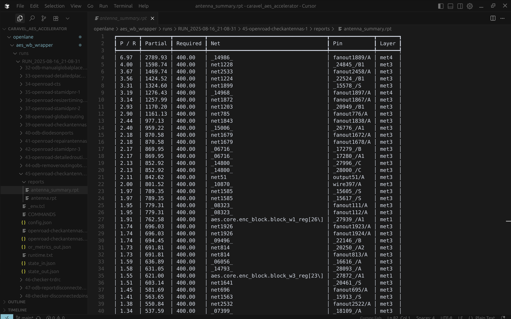
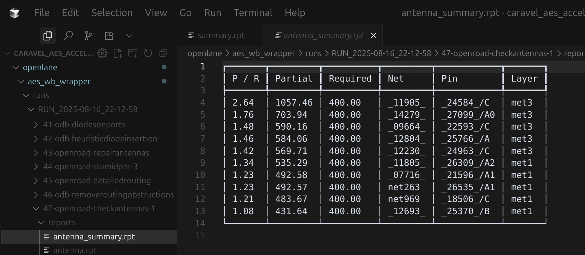

# Step 4 - Setup

## 1. Cài đặt **Nix** và **Openlane2**

## 2. Tạo project từ Caravel template

Tạo 1 repo github từ template của Caravel, tích hợp sẵn bộ công cụ Openlane2 tại [Caravel project](https://github.com/efabless/caravel_user_project_ol2/generate).

Mở terminal, clone repo mới tạo về, ví dụ:
```sh
git clone https://github.com/truong92cdv/caravel_aes_accelerator.git ~/aes
```

## 3. Chuẩn bị file RTL

File RTL thiết kế sẽ được đặt trong thư mục **~/aes/verilog/rtl/**. File **user_project_wrapper.v** là wrapper chứa thiết kế của chúng ta. Bạn cần sửa lại đoạn code *user project is instantiated  here*. Đồng thời copy các file thiết kế của **aes** về cùng thư mục. Bạn có thể copy thủ công hoặc dùng script download tôi đã tạo sẵn:
```sh
curl -s https://raw.githubusercontent.com/truong92cdv/aes/refs/heads/main/script/download.sh ~/download.sh
chmod +x ~/download.sh
~/download.sh https://github.com/truong92cdv/aes/rtl ~/aes/verilog/rtl
```

## 4. Tạo macro AES Wishbone Wrapper

Tạo thư mục chứa AES wishbone wrapper
```sh
mkdir -p ~/aes/openlane/aes_wb_wrapper
```

Tạo file **~/aes/openlane/aes_wb_wrapper/config.json** và cấu hình như sau:
```json
{
    "DESIGN_NAME": "aes_wb_wrapper",
    "FP_PDN_MULTILAYER": false,
    "CLOCK_PORT": "wb_clk_i",
    "CLOCK_PERIOD": 25,
    "VERILOG_FILES": [
        "dir::../../verilog/rtl/aes.v",
        "dir::../../verilog/rtl/aes_core.v",
        "dir::../../verilog/rtl/aes_decipher_block.v",
        "dir::../../verilog/rtl/aes_encipher_block.v",
        "dir::../../verilog/rtl/aes_inv_sbox.v",
        "dir::../../verilog/rtl/aes_key_mem.v",
        "dir::../../verilog/rtl/aes_sbox.v",
        "dir::../../verilog/rtl/aes_wb_wrapper.v"
    ],
    "FP_CORE_UTIL": 40
}
```

## 5. Chạy Openlane2 flow cho Macro AES Wishbone Wrapper

Khởi chạy Openlane2 trong môi trường nix-shell, thay đổi đường dẫn theo vị trí cài đặt openlane2 của bạn.
```sh
nix-shell --pure ~/openlane2/shell.nix
```

Chạy flow thiết kế với Openlane2. Hãy đảm bảo bạn đang trong môi trường **nix-shell**
```sh
[nix-shell:~]$ openlane ~/aes/openlane/aes_wb_wrapper/config.json
```
Đợi flow chạy hoàn tất, khoảng 20 phút :(

Mở KLayout xem kết quả

```sh
[nix-shell:~]$ openlane --last-run --flow openinklayout ~/aes/openlane/aes_wb_wrapper/config.json
```


De nhin ro layout nhu tren hinh, ban can tat cac layer ***areaid.lowTapDensity*** va ***areaid.standardc*** (double-click vao layer tuong ung trong KLayout).

## 6. Kiểm tra kết quả timing

Khi flow hoan tat. Ban se thay 1 folder co dang **~/aes/openlane/aes_wb_wrapper/runs/RUN_2025-08-16_21-08-31**. Ten folder **RUN_xx** thay doi theo moi lan chay flow. Day la folder chua ket qua chay Openlane.

### Check Antennas
Kiem tra file **~/aes/openlane/aes_wb_wrapper/runs/RUN_xx/xx-openroad-checkantennas-1/reports/antenna_summary.rpt**. Ban se thay rat nhieu loi ***antenna violations***:



### Check STA
Kiem tra file **~/aes/openlane/aes_wb_wrapper/runs/RUN_xx/xx-openroad-stapostpnr/summary.rpt**. Ket qua cho thay khong co loi ***hold violation*** va ***setup violation***, nhung co nhieu loi ***max cap*** va ***max slew violation***. Trong do, corner **max_ss_100C_1v60** gay ra nhieu loi nhat:


### Check DRC

Check Magic.DRC tai file **~/aes/openlane/aes_wb_wrapper/runs/RUN_xx/xx-magic-drc/reports/drc_violations.magic.rpt**. Ket qua check DRC voi Magic khong co loi.

```
aes_wb_wrapper
----------------------------------------
[INFO] COUNT: 0
[INFO] Should be divided by 3 or 4
```

Check KLayout.DRC tai file **~/aes/openlane/aes_wb_wrapper/runs/RUN_xx/xx-klayout-drc/reports/drc_violations.klayout.json**. Ket qua check DRC voi KLayout khong co loi (total: 0).

```
{
    ...
    "areaid_re_OFFGRID": 0,
    "total": 0
}
```

### Check LVS

Check Netgen.LVS tai file **~/aes/openlane/aes_wb_wrapper/runs/RUN_xx/xx-netgen-lvs/reports/lvs.netgen.rpt**. Ket qua check LVS voi Netgen OK.

```
...
Cell pin lists are equivalent.
Device classes aes_wb_wrapper and aes_wb_wrapper are equivalent.
Final result: Circuits match uniquely.
```

## 7. Debug

De fix cac loi timing tren, can sua lai file **~/aes/openlane/aes_wb_wrapper/config.json** nhu sau:

```json
{
    "DESIGN_NAME": "aes_wb_wrapper",
    "FP_PDN_MULTILAYER": false,
    "CLOCK_PORT": "wb_clk_i",
    "CLOCK_PERIOD": 25,
    "VERILOG_FILES": [
        "dir::../../verilog/rtl/aes.v",
        "dir::../../verilog/rtl/aes_core.v",
        "dir::../../verilog/rtl/aes_decipher_block.v",
        "dir::../../verilog/rtl/aes_encipher_block.v",
        "dir::../../verilog/rtl/aes_inv_sbox.v",
        "dir::../../verilog/rtl/aes_key_mem.v",
        "dir::../../verilog/rtl/aes_sbox.v",
        "dir::../../verilog/rtl/aes_wb_wrapper.v"
    ],
    "FP_CORE_UTIL": 40,
    "GRT_ANTENNA_ITERS": 10,
    "RUN_HEURISTIC_DIODE_INSERTION": true,
    "HEURISTIC_ANTENNA_THRESHOLD": 200,
    "DESIGN_REPAIR_MAX_WIRE_LENGTH": 800,
    "DEFAULT_CORNER": "max_ss_100C_1v60",
    "RUN_POST_GRT_DESIGN_REPAIR": true,
    "PNR_SDC_FILE": "dir::pnr.sdc",
    "SIGNOFF_SDC_FILE": "dir::signoff.sdc"
}
```

Tao them 2 file **~/aes/openlane/aes_wb_wrapper/pnr.sdc** va **~/aes/openlane/aes_wb_wrapper/signoff.sdc**. Copy 2 file toi da tao san ve:

```sh
curl -s https://raw.githubusercontent.com/truong92cdv/aes/refs/heads/main/config/pnr.sdc ~/aes/openlane/aes_wb_wrapper/pnr.sdc
curl -s https://raw.githubusercontent.com/truong92cdv/aes/refs/heads/main/config/signoff.sdc ~/aes/openlane/aes_wb_wrapper/signoff.sdc
```

## 8. Chay lai Openlane2 flow, kiem tra ket qua timing

```sh
[nix-shell:~]$ openlane ~/aes/openlane/aes_wb_wrapper/config.json
```

Khi flow hoan tat. Ban se thay 1 folder **RUN_xx** moi **~/aes/openlane/aes_wb_wrapper/runs/RUN_2025-08-16_22-12-58**. 

### Re-check Antennas

Kiem tra file **~/aes/openlane/aes_wb_wrapper/runs/RUN_xx/xx-openroad-checkantennas-1/reports/antenna_summary.rpt**. Cac loi ***antenna violations*** giam di dang ke:



### Re-check STA

Kiem tra file **~/aes/openlane/aes_wb_wrapper/runs/RUN_xx/xx-openroad-stapostpnr/summary.rpt**. Tat ca cac loi STA da duoc khac phuc


## 9. Luu ket qua layout Macro AES wishbone wrapper

```sh
[nix-shell:~]$ bash ~/aes/openlane/copy_views.sh ~/aes aes_wb_wrapper RUN_TAG
```

Thay **RUN_TAG** bang ten folder **RUN_xx** moi chay thanh cong

## 10. Tạo macro User Project Wrapper

User Project Wrapper la macro ben trong chip Caravel chip danh rieng cho nguoi dung. Voi cac cau hinh fixed Floorplan, fixed I/Os pin, fixed power rings khong duoc thay doi. 
Kiem tra file **~/aes/openlane/user_project_wrapper/config.json**. Ban can sua doi doan khai bao Macro, thay **user_proj_example** thanh **aes_wb_wrapper**. Dat macro o vi tri goc duoi trai [10, 20]:

```json
    "MACROS": {
        "aes_wb_wrapper": {
            "gds": [
                "dir::../../gds/aes_wb_wrapper.gds"
            ],
            "lef": [
                "dir::../../lef/aes_wb_wrapper.lef"
            ],
            "instances": {
                "mprj": {
                    "location": [10, 20],
                    "orientation": "N"
                }
            },
            "nl": [
                "dir::../../verilog/gl/aes_wb_wrapper.v"
            ],
            "spef": {
                "min_*": [
                    "dir::../../spef/multicorner/aes_wb_wrapper.min.spef"
                ],
                "nom_*": [
                    "dir::../../spef/multicorner/aes_wb_wrapper.nom.spef"
                ],
                "max_*": [
                    "dir::../../spef/multicorner/aes_wb_wrapper.max.spef"
                ]
            },
            "lib": {
                "*": "dir::../../lib/aes_wb_wrapper.lib"
            }
        }
    },
```

Thay doi power pins cho phu hop voi power pins cuar macro

```json
    "PDN_MACRO_CONNECTIONS": ["mprj vccd2 vssd2 VPWR VGND"],
```

Ngoai ra, ban can sua doi file **~/aes/openlane/aes_wb_wrapper/config.json**, them cau hinh **FP_PIN_ORDER_CFG**:

```json
{
    "DESIGN_NAME": "aes_wb_wrapper",
    "FP_PDN_MULTILAYER": false,
    "CLOCK_PORT": "wb_clk_i",
    "CLOCK_PERIOD": 25,
    "VERILOG_FILES": [
        "dir::../../../secworks_aes/src/rtl/aes.v",
        "dir::../../../secworks_aes/src/rtl/aes_core.v",
        "dir::../../../secworks_aes/src/rtl/aes_decipher_block.v",
        "dir::../../../secworks_aes/src/rtl/aes_encipher_block.v",
        "dir::../../../secworks_aes/src/rtl/aes_inv_sbox.v",
        "dir::../../../secworks_aes/src/rtl/aes_key_mem.v",
        "dir::../../../secworks_aes/src/rtl/aes_sbox.v",
        "dir::../../verilog/rtl/aes_wb_wrapper.v"
    ],
    "FP_CORE_UTIL": 40,
    "GRT_ANTENNA_ITERS": 10,
    "RUN_HEURISTIC_DIODE_INSERTION": true,
    "HEURISTIC_ANTENNA_THRESHOLD": 200,
    "DESIGN_REPAIR_MAX_WIRE_LENGTH": 800,
    "DEFAULT_CORNER": "max_ss_100C_1v60",
    "RUN_POST_GRT_DESIGN_REPAIR": true,
    "PNR_SDC_FILE": "dir::pnr.sdc",
    "SIGNOFF_SDC_FILE": "dir::signoff.sdc",
    "FP_PIN_ORDER_CFG": "dir::pin_order.cfg"
}
```

Dong thoi, tao file **~/aes/openlane/aes_wb_wrapper/pin_order.cfg** co noi dung sau, de dat cac chan pin cua aes_wb_wrapper xuong phia duoi:

```
#S
wb_.*
wbs_.*
```

## 11. Chay lai Openlane flow cho **aes_wb_wrapper**

```sh
[nix-shell:~]$ openlane ~/aes/openlane/aes_wb_wrapper/config.json
```

Kiem tra lai cac reports, luu ket qua

```sh
[nix-shell:~]$ bash ~/aes/openlane/copy_views.sh ~/aes aes_wb_wrapper RUN_TAG
```

## 12. Chay Openlane flow cho **user_project_wrapper**

```sh
[nix-shell:~]$ openlane ~/aes/openlane/user_project_wrapper/config.json
```

Mo KLayout xem ket qua

```sh
[nix-shell:~]$ openlane --last-run --flow openinklayout ~/aes/openlane/user_project_wrapper/config.json
```


## 13. Kiem tra lai ket qua timing, luu ket qua

Kiem tra file **~/aes/openlane/user_project_wrapper/runs/RUN_xx/xx-openroad-stapostpnr/summary.rpt**.


