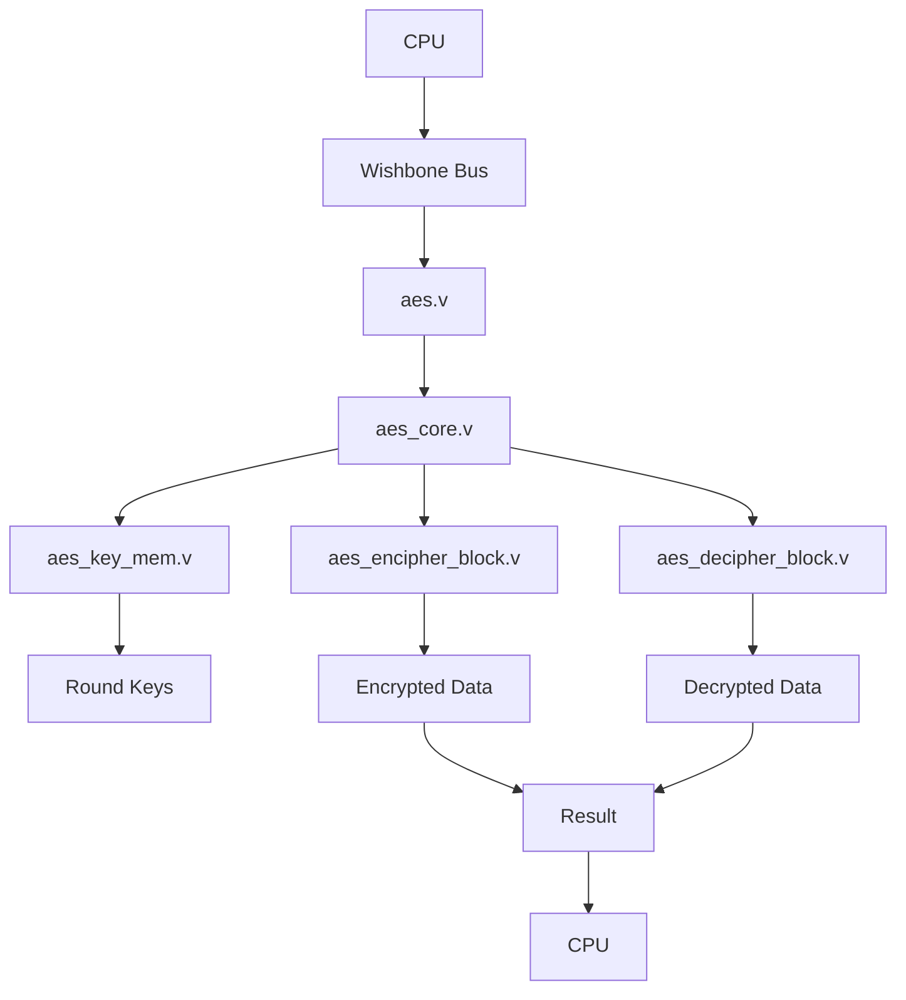
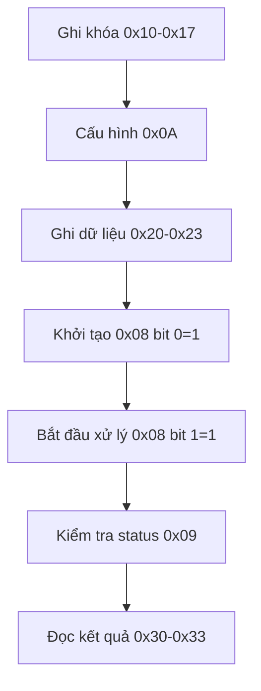

# Step 2 - RTL Design

**[🏠 Home](../README.md)**

## 📋 Tổng Quan

Phần này mô tả kiến trúc RTL của AES Accelerator, bao gồm các module chính và luồng thực thi CPU cần thiết để giao tiếp với AES core qua Wishbone protocol.

---

## 🏗️ Kiến Trúc Tổng Thể

### **Module Hierarchy**
```
aes.v (Top-Level)
├── aes_core.v (Control Logic)
├── aes_key_mem.v (Key Management)
├── aes_encipher_block.v (Encryption)
├── aes_decipher_block.v (Decryption)
├── aes_sbox.v (S-box Lookup)
└── aes_inv_sbox.v (Inverse S-box)
```

### **Data Flow**


---

## 🔧 Các Module Chính

### **1. aes.v - Module Chính**
- **Chức năng**: Top-level module, Wishbone bus interface
- **Ports**: Clock, reset, Wishbone bus signals
- **Memory Map**: Control registers, key registers, data registers
- **Interface**: CPU communication thông qua Wishbone bus

### **2. aes_core.v - Điều Khiển Trung Tâm**
- **Chức năng**: State machine, round control, module coordination
- **States**: IDLE, INIT, NEXT, ERROR
- **Control**: Key expansion, encryption/decryption flow
- **Timing**: Round counter, max rounds (10 cho AES-128, 14 cho AES-256)

### **3. aes_key_mem.v - Quản Lý Khóa**
- **Chức năng**: Key storage, key expansion, round key generation
- **Algorithm**: AES key expansion theo NIST FIPS 197
- **Support**: AES-128 (11 round keys), AES-256 (15 round keys)
- **Features**: S-box integration, Rcon constants

### **4. aes_encipher_block.v - Mã Hóa**
- **Transformations**: SubBytes, ShiftRows, MixColumns, AddRoundKey
- **Galois Field**: gm2, gm3 functions cho MixColumns
- **State Array**: 4x4 byte array management
- **Timing**: 1 round per clock cycle

### **5. aes_decipher_block.v - Giải Mã**
- **Inverse Transformations**: InvSubBytes, InvShiftRows, InvMixColumns, AddRoundKey
- **Inverse Galois Field**: gm9, gm11, gm13, gm14 functions
- **Round Order**: Reverse order so với encryption
- **Verification**: Round-trip testing (encrypt -> decrypt -> original)

---

## 📊 Memory Map

### **Core Information (Read Only)**
| Địa Chỉ | Tên | Mô Tả |
|----------|------|--------|
| `0x00` | `CORE_NAME0` | Tên core (32 bit thấp) |
| `0x01` | `CORE_NAME1` | Tên core (32 bit cao) |
| `0x02` | `CORE_VERSION` | Phiên bản |

### **Control Register (0x08) - Write/Read**
| Bit | Tên | Mô Tả |
|-----|------|--------|
| 0 | `INIT` | 1 = Khởi tạo khóa |
| 1 | `NEXT` | 1 = Bắt đầu xử lý |

### **Status Register (0x09) - Read Only**
| Bit | Tên | Mô Tả |
|-----|------|--------|
| 0 | `READY` | 1 = Core sẵn sàng |
| 1 | `VALID` | 1 = Kết quả hợp lệ |

### **Configuration Register (0x0A) - Write Only**
| Bit | Tên | Mô Tả |
|-----|------|--------|
| 0 | `ENCDEC` | 0 = Mã hóa, 1 = Giải mã |
| 1 | `KEYLEN` | 0 = 128-bit, 1 = 256-bit |

### **Key Registers (0x10-0x17) - Write Only**
| Địa Chỉ | Tên | Mô Tả |
|----------|------|--------|
| `0x10-0x13` | `KEY[0:3]` | Khóa 128-bit (4 words) |
| `0x14-0x17` | `KEY[4:7]` | Khóa 256-bit (4 words thêm) |

### **Data Registers (0x20-0x23) - Write Only**
| Địa Chỉ | Tên | Mô Tả |
|----------|------|--------|
| `0x20-0x23` | `BLOCK[0:3]` | Dữ liệu input (4 words) |

### **Result Registers (0x30-0x33) - Read Only**
| Địa Chỉ | Tên | Mô Tả |
|----------|------|--------|
| `0x30-0x33` | `RESULT[0:3]` | Kết quả output (4 words) |

---

## 🔧 Wishbone Bus Interface

### **Signals**
```verilog
// Clock và Reset
wb_clk_i      // Wishbone clock
wb_rst_i      // Wishbone reset (active low)

// Bus Interface
wbs_stb_i     // Strobe signal
wbs_cyc_i     // Cycle signal
wbs_we_i      // Write enable
wbs_sel_i     // Byte select
wbs_adr_i     // Address bus
wbs_dat_i     // Write data
wbs_dat_o     // Read data
wbs_ack_o     // Acknowledge
```

---

## ⏱️ Timing và Performance

### **Clock Cycles**
- **Key Expansion**: 1-2 clock cycles
- **Single Round**: 1 clock cycle
- **AES-128**: ~10 clock cycles
- **AES-256**: ~14 clock cycles

### **Latency**
- **Setup Time**: 1 clock cycle
- **Processing Time**: 10-14 clock cycles
- **Total Latency**: 11-15 clock cycles

### **Throughput**
- **AES-128**: 1 block per ~10 clock cycles
- **AES-256**: 1 block per ~14 clock cycles

---

## 🔄 Luồng Thực Thi CPU

### **Quy Trình Thực Hiện Chi Tiết**

#### **Bước 1: Ghi Khóa (Key Loading)**
```verilog
// Khóa 128-bit (4 words)
wbs_adr_i = 0x10, wbs_dat_i = 0x2b7e1516, wbs_we_i = 1  // Key word 0
wbs_adr_i = 0x11, wbs_dat_i = 0x28aed2a6, wbs_we_i = 1  // Key word 1
wbs_adr_i = 0x12, wbs_dat_i = 0xabf71588, wbs_we_i = 1  // Key word 2
wbs_adr_i = 0x13, wbs_dat_i = 0x09cf4f3c, wbs_we_i = 1  // Key word 3

// Khóa 256-bit (8 words) - thêm 4 words nữa
wbs_adr_i = 0x14, wbs_dat_i = 0x00000000, wbs_we_i = 1  // Key word 4
wbs_adr_i = 0x15, wbs_dat_i = 0x00000000, wbs_we_i = 1  // Key word 5
wbs_adr_i = 0x16, wbs_dat_i = 0x00000000, wbs_we_i = 1  // Key word 6
wbs_adr_i = 0x17, wbs_dat_i = 0x00000000, wbs_we_i = 1  // Key word 7
```

#### **Bước 2: Cấu Hình (Configuration)**
```verilog
// Cấu hình chế độ và độ dài khóa
wbs_adr_i = 0x0A, wbs_dat_i = 0x00000000, wbs_we_i = 1  // Encrypt + 128-bit key
// hoặc
wbs_adr_i = 0x0A, wbs_dat_i = 0x00000001, wbs_we_i = 1  // Decrypt + 128-bit key
// hoặc
wbs_adr_i = 0x0A, wbs_dat_i = 0x00000002, wbs_we_i = 1  // Encrypt + 256-bit key
// hoặc
wbs_adr_i = 0x0A, wbs_dat_i = 0x00000003, wbs_we_i = 1  // Decrypt + 256-bit key
```

#### **Bước 3: Ghi Dữ Liệu (Data Input)**
```verilog
// Ghi khối dữ liệu cần mã hóa/giải mã (4 words)
wbs_adr_i = 0x20, wbs_dat_i = 0x6bc1bee2, wbs_we_i = 1  // Block word 0
wbs_adr_i = 0x21, wbs_dat_i = 0x2e409f96, wbs_we_i = 1  // Block word 1
wbs_adr_i = 0x22, wbs_dat_i = 0xe93d7e11, wbs_we_i = 1  // Block word 2
wbs_adr_i = 0x23, wbs_dat_i = 0x7393172a, wbs_we_i = 1  // Block word 3
```

#### **Bước 4: Khởi Tạo (Initialize)**
```verilog
// Khởi tạo khóa (key expansion)
wbs_adr_i = 0x08, wbs_dat_i = 0x00000001, wbs_we_i = 1  // Set init bit
```

#### **Bước 5: Bắt Đầu Xử Lý (Start Processing)**
```verilog
// Bắt đầu mã hóa/giải mã
wbs_adr_i = 0x08, wbs_dat_i = 0x00000002, wbs_we_i = 1  // Set next bit
```

### **Kiểm Tra Trạng Thái và Đọc Kết Quả**

#### **Kiểm Tra Status**
```verilog
// Đọc status register
wbs_adr_i = 0x09, wbs_we_i = 0
// wbs_dat_o sẽ chứa status
// Bit 0 = 1: Core sẵn sàng
// Bit 1 = 1: Kết quả hợp lệ
```

#### **Đọc Kết Quả**
```verilog
// Đọc kết quả (4 words)
wbs_adr_i = 0x30, wbs_we_i = 0  // Result word 0
wbs_dat_o = 0x3ad77bb4          // Kết quả byte 0-3

wbs_adr_i = 0x31, wbs_we_i = 0  // Result word 1  
wbs_dat_o = 0x0d7a3660          // Kết quả byte 4-7

wbs_adr_i = 0x32, wbs_we_i = 0  // Result word 2
wbs_dat_o = 0xa89ecaf3          // Kết quả byte 8-11

wbs_adr_i = 0x33, wbs_we_i = 0  // Result word 3
wbs_dat_o = 0x2466ef97          // Kết quả byte 12-15
```

### **Ví Dụ Cụ Thể - Mã Hóa AES-128**

#### **Setup Phase**
```verilog
// 1. Ghi khóa NIST test vector
wbs_adr_i = 0x10, wbs_dat_i = 0x2b7e1516, wbs_we_i = 1  // Key[0]
wbs_adr_i = 0x11, wbs_dat_i = 0x28aed2a6, wbs_we_i = 1  // Key[1]
wbs_adr_i = 0x12, wbs_dat_i = 0xabf71588, wbs_we_i = 1  // Key[2]
wbs_adr_i = 0x13, wbs_dat_i = 0x09cf4f3c, wbs_we_i = 1  // Key[3]

// 2. Cấu hình mã hóa + 128-bit
wbs_adr_i = 0x0A, wbs_dat_i = 0x00000000, wbs_we_i = 1

// 3. Ghi plaintext
wbs_adr_i = 0x20, wbs_dat_i = 0x6bc1bee2, wbs_we_i = 1  // Plaintext[0]
wbs_adr_i = 0x21, wbs_dat_i = 0x2e409f96, wbs_we_i = 1  // Plaintext[1]
wbs_adr_i = 0x22, wbs_dat_i = 0xe93d7e11, wbs_we_i = 1  // Plaintext[2]
wbs_adr_i = 0x23, wbs_dat_i = 0x7393172a, wbs_we_i = 1  // Plaintext[3]
```

#### **Execution Phase**
```verilog
// 4. Khởi tạo khóa
wbs_adr_i = 0x08, wbs_dat_i = 0x00000001, wbs_we_i = 1

// 5. Bắt đầu mã hóa
wbs_adr_i = 0x08, wbs_dat_i = 0x00000002, wbs_we_i = 1
```

#### **Result Phase**
```verilog
// 6. Kiểm tra status
wbs_adr_i = 0x09, wbs_we_i = 0
// Đợi wbs_dat_o[0] = 1 (ready) và wbs_dat_o[1] = 1 (valid)

// 7. Đọc ciphertext
wbs_adr_i = 0x30, wbs_we_i = 0  // wbs_dat_o = 0x3ad77bb4
wbs_adr_i = 0x31, wbs_we_i = 0  // wbs_dat_o = 0x0d7a3660
wbs_adr_i = 0x32, wbs_we_i = 0  // wbs_dat_o = 0xa89ecaf3
wbs_adr_i = 0x33, wbs_we_i = 0  // wbs_dat_o = 0x2466ef97
```

### **Timing và Sequence**


### **Tín Hiệu Quan Trọng**
| Tín Hiệu | Mục Đích | Giá Trị |
|----------|----------|---------|
| `wbs_adr_i` | Chọn register | `0x00-0x33` |
| `wbs_dat_i` | Dữ liệu ghi | `32-bit` |
| `wbs_we_i` | Hướng truyền | `1=write, 0=read` |
| `wbs_stb_i` | Chọn slave | `1=chọn AES` |
| `wbs_cyc_i` | Giao dịch | `1=active` |

---

### **Giải Thích Chi Tiết Từng Module**

* [aes.v](docs/rtl_aes.md)
* [aes_core.v](docs/rtl_aes_core.md)
* [aes_encipher_block.v](docs/rtl_aes_encipher_block.md)
* [aes_decipher_block.v](docs/rtl_aes_decipher_block.md)
* [aes_key_mem.v](docs/rtl_aes_key_mem.md)
* [aes_sbox.v](docs/rtl_aes_sbox.md)
* [aes_inv_sbox.v](docs/rtl_aes_inv_sbox.md)

---

**[🧪 Step 3 - RTL Testbench](03_rtl_testbench.md)** - Tổng quan testbench và kết quả
