# CPU Flow - Tín Hiệu Điều Khiển AES Core

## 📋 Tổng Quan

Tài liệu này mô tả chi tiết các tín hiệu mà CPU cần gửi đến AES core để thực hiện mã hóa hoặc giải mã, bao gồm memory map, quy trình thực hiện và ví dụ cụ thể.

---

## 🔌 Tín Hiệu Cơ Bản

### Clock và Reset
| Tín Hiệu | Mô Tả | Hướng |
|----------|--------|--------|
| `wb_clk_i` | Clock signal từ CPU | Input |
| `wb_rst_i` | Reset signal từ CPU (active low) | Input |

### Wishbone Bus Control
| Tín Hiệu | Mô Tả | Hướng |
|----------|--------|--------|
| `wbs_stb_i` | Strobe - CPU chọn AES core | Input |
| `wbs_cyc_i` | Cycle - Giao dịch bus đang diễn ra | Input |
| `wbs_we_i` | Write Enable - 1=write, 0=read | Input |
| `wbs_sel_i` | Byte Select - Chọn byte nào trong word | Input |

### Dữ Liệu
| Tín Hiệu | Mô Tả | Hướng |
|----------|--------|--------|
| `wbs_adr_i` | Địa chỉ (8-bit) - Chọn register nào | Input |
| `wbs_dat_i` | Dữ liệu ghi (32-bit) - Dữ liệu muốn ghi | Input |
| `wbs_dat_o` | Dữ liệu đọc (32-bit) - Dữ liệu đọc được | Output |

---

## 🗺️ Memory Map Chi Tiết

### 📖 Core Information (Read Only)
| Địa Chỉ | Tên | Mô Tả | Giá Trị |
|----------|------|--------|---------|
| `0x00` | `CORE_NAME0` | Tên core (32 bit thấp) | `"aes "` |
| `0x01` | `CORE_NAME1` | Tên core (32 bit cao) | `"    "` |
| `0x02` | `CORE_VERSION` | Phiên bản | `"0.60"` |

### ⚙️ Control Register (0x08) - Write/Read
| Bit | Tên | Mô Tả | Hướng |
|-----|------|--------|--------|
| 0 | `CTRL_INIT_BIT` | 1 = Khởi tạo khóa | Write |
| 1 | `CTRL_NEXT_BIT` | 1 = Bắt đầu mã hóa/giải mã | Write |
| 2-31 | Reserved | Không sử dụng | - |

**CPU đọc để kiểm tra trạng thái:**
| Bit | Tên | Mô Tả |
|-----|------|--------|
| 0 | `init_reg` | Trạng thái khởi tạo |
| 1 | `next_reg` | Trạng thái xử lý |
| 2 | `encdec_reg` | Chế độ mã hóa/giải mã |
| 3 | `keylen_reg` | Độ dài khóa |

### 📊 Status Register (0x09) - Read Only
| Bit | Tên | Mô Tả |
|-----|------|--------|
| 0 | `STATUS_READY_BIT` | 1 = Core sẵn sàng |
| 1 | `STATUS_VALID_BIT` | 1 = Kết quả hợp lệ |
| 2-31 | Reserved | Không sử dụng |

### ⚙️ Configuration Register (0x0A) - Write Only
| Bit | Tên | Mô Tả |
|-----|------|--------|
| 0 | `CTRL_ENCDEC_BIT` | 0 = Mã hóa, 1 = Giải mã |
| 1 | `CTRL_KEYLEN_BIT` | 0 = 128-bit, 1 = 256-bit |
| 2-31 | Reserved | Không sử dụng |

---

## 🔑 Quy Trình Thực Hiện Chi Tiết

### 1️⃣ **Bước 1: Ghi Khóa (Key Loading)**

#### Khóa 128-bit (4 words)
```verilog
wbs_adr_i = 0x10, wbs_dat_i = 0x2b7e1516, wbs_we_i = 1  // Key word 0
wbs_adr_i = 0x11, wbs_dat_i = 0x28aed2a6, wbs_we_i = 1  // Key word 1
wbs_adr_i = 0x12, wbs_dat_i = 0xabf71588, wbs_we_i = 1  // Key word 2
wbs_adr_i = 0x13, wbs_dat_i = 0x09cf4f3c, wbs_we_i = 1  // Key word 3
```

#### Khóa 256-bit (8 words) - thêm 4 words nữa
```verilog
wbs_adr_i = 0x14, wbs_dat_i = 0x00000000, wbs_we_i = 1  // Key word 4
wbs_adr_i = 0x15, wbs_dat_i = 0x00000000, wbs_we_i = 1  // Key word 5
wbs_adr_i = 0x16, wbs_dat_i = 0x00000000, wbs_we_i = 1  // Key word 6
wbs_adr_i = 0x17, wbs_dat_i = 0x00000000, wbs_we_i = 1  // Key word 7
```

### 2️⃣ **Bước 2: Cấu Hình (Configuration)**

```verilog
// Cấu hình chế độ và độ dài khóa
wbs_adr_i = 0x0A, wbs_dat_i = 0x00000000, wbs_we_i = 1  // Encrypt + 128-bit key
// hoặc
wbs_adr_i = 0x0A, wbs_dat_i = 0x00000001, wbs_we_i = 1  // Decrypt + 128-bit key
// hoặc
wbs_adr_i = 0x0A, wbs_dat_i = 0x00000002, wbs_we_i = 1  // Encrypt + 256-bit key
// hoặc
wbs_adr_i = 0x0A, wbs_dat_i = 0x00000003, wbs_we_i = 1  // Decrypt + 256-bit key
```

### 3️⃣ **Bước 3: Ghi Dữ Liệu (Data Input)**

```verilog
// Ghi khối dữ liệu cần mã hóa/giải mã (4 words)
wbs_adr_i = 0x20, wbs_dat_i = 0x6bc1bee2, wbs_we_i = 1  // Block word 0
wbs_adr_i = 0x21, wbs_dat_i = 0x2e409f96, wbs_we_i = 1  // Block word 1
wbs_adr_i = 0x22, wbs_dat_i = 0xe93d7e11, wbs_we_i = 1  // Block word 2
wbs_adr_i = 0x23, wbs_dat_i = 0x7393172a, wbs_we_i = 1  // Block word 3
```

### 4️⃣ **Bước 4: Khởi Tạo (Initialize)**

```verilog
// Khởi tạo khóa (key expansion)
wbs_adr_i = 0x08, wbs_dat_i = 0x00000001, wbs_we_i = 1  // Set init bit
```

### 5️⃣ **Bước 5: Bắt Đầu Xử Lý (Start Processing)**

```verilog
// Bắt đầu mã hóa/giải mã
wbs_adr_i = 0x08, wbs_dat_i = 0x00000002, wbs_we_i = 1  // Set next bit
```

---

## 🔍 Kiểm Tra Trạng Thái (Status Checking)

### Kiểm Tra Sẵn Sàng (Ready Check)
```verilog
// Đọc status register
wbs_adr_i = 0x09, wbs_we_i = 0
// wbs_dat_o sẽ chứa status
// Bit 0 = 1: Core sẵn sàng
// Bit 1 = 1: Kết quả hợp lệ
```

### Kiểm Tra Kết Quả (Result Check)
```verilog
// Đọc kết quả (4 words)
wbs_adr_i = 0x30, wbs_we_i = 0  // Result word 0
wbs_dat_o = 0x3ad77bb4          // Kết quả byte 0-3

wbs_adr_i = 0x31, wbs_we_i = 0  // Result word 1  
wbs_dat_o = 0x0d7a3660          // Kết quả byte 4-7

wbs_adr_i = 0x32, wbs_we_i = 0  // Result word 2
wbs_dat_o = 0xa89ecaf3          // Kết quả byte 8-11

wbs_adr_i = 0x33, wbs_we_i = 0  // Result word 3
wbs_dat_o = 0x2466ef97          // Kết quả byte 12-15
```

---

## ⏱️ Timing và Sequence

### Thứ Tự Thực Hiện

```mermaid
graph TD
    A[Ghi khóa 0x10-0x17] --> B[Cấu hình 0x0A]
    B --> C[Ghi dữ liệu 0x20-0x23]
    C --> D[Khởi tạo 0x08 bit 0=1]
    D --> E[Bắt đầu xử lý 0x08 bit 1=1]
    E --> F[Kiểm tra status 0x09]
    F --> G[Đọc kết quả 0x30-0x33]
```


### Timing Constraints
```verilog
// Mỗi bước ghi phải đợi wbs_ack_o = 1
// Khởi tạo phải đợi status ready = 1
// Xử lý phải đợi status valid = 1
```

---

## 💡 Ví Dụ Cụ Thể - Mã Hóa AES-128

### 🚀 Setup Phase

#### 1. Ghi khóa NIST test vector
```verilog
wbs_adr_i = 0x10, wbs_dat_i = 0x2b7e1516, wbs_we_i = 1  // Key[0]
wbs_adr_i = 0x11, wbs_dat_i = 0x28aed2a6, wbs_we_i = 1  // Key[1]
wbs_adr_i = 0x12, wbs_dat_i = 0xabf71588, wbs_we_i = 1  // Key[2]
wbs_adr_i = 0x13, wbs_dat_i = 0x09cf4f3c, wbs_we_i = 1  // Key[3]
```

#### 2. Cấu hình mã hóa + 128-bit
```verilog
wbs_adr_i = 0x0A, wbs_dat_i = 0x00000000, wbs_we_i = 1
```

#### 3. Ghi plaintext
```verilog
wbs_adr_i = 0x20, wbs_dat_i = 0x6bc1bee2, wbs_we_i = 1  // Plaintext[0]
wbs_adr_i = 0x21, wbs_dat_i = 0x2e409f96, wbs_we_i = 1  // Plaintext[1]
wbs_adr_i = 0x22, wbs_dat_i = 0xe93d7e11, wbs_we_i = 1  // Plaintext[2]
wbs_adr_i = 0x23, wbs_dat_i = 0x7393172a, wbs_we_i = 1  // Plaintext[3]
```

### ⚡ Execution Phase

#### 4. Khởi tạo khóa
```verilog
wbs_adr_i = 0x08, wbs_dat_i = 0x00000001, wbs_we_i = 1
```

#### 5. Bắt đầu mã hóa
```verilog
wbs_adr_i = 0x08, wbs_dat_i = 0x00000002, wbs_we_i = 1
```

### 📊 Result Phase

#### 6. Kiểm tra status
```verilog
wbs_adr_i = 0x09, wbs_we_i = 0
// Đợi wbs_dat_o[0] = 1 (ready) và wbs_dat_o[1] = 1 (valid)
```

#### 7. Đọc ciphertext
```verilog
wbs_adr_i = 0x30, wbs_we_i = 0  // wbs_dat_o = 0x3ad77bb4
wbs_adr_i = 0x31, wbs_we_i = 0  // wbs_dat_o = 0x0d7a3660
wbs_adr_i = 0x32, wbs_we_i = 0  // wbs_dat_o = 0xa89ecaf3
wbs_adr_i = 0x33, wbs_we_i = 0  // wbs_dat_o = 0x2466ef97
```

---

## 📋 Tóm Tắt Tín Hiệu Quan Trọng

| Tín Hiệu | Mục Đích | Giá Trị |
|----------|----------|---------|
| `wbs_adr_i` | Chọn register | `0x00-0x33` |
| `wbs_dat_i` | Dữ liệu ghi | `32-bit` |
| `wbs_we_i` | Hướng truyền | `1=write, 0=read` |
| `wbs_stb_i` | Chọn slave | `1=chọn AES` |
| `wbs_cyc_i` | Giao dịch | `1=active` |
| `wbs_clk_i` | Clock | `System clock` |
| `wbs_rst_i` | Reset | `Active low` |

---

## 🎯 Kết Luận

Với các tín hiệu này, CPU có thể hoàn toàn điều khiển AES core để thực hiện mã hóa và giải mã một cách chính xác và hiệu quả. Quy trình được thiết kế theo thứ tự logic và dễ theo dõi, đảm bảo tính ổn định và hiệu suất cao.

---

## 🔗 Liên Kết Tài Liệu

### **📚 Tài Liệu Lý Thuyết**
- **[01_theory.md](01_theory.md)** - Lý thuyết AES và Caravel Platform
- **[06_references.md](06_references.md)** - Tài liệu tham khảo và nguồn

### **🏗️ Thiết Kế RTL**
- **[02_rtl_design.md](02_rtl_design.md)** - Kiến trúc RTL và luồng thực thi CPU
- **[rtl_aes.md](rtl_aes.md)** - Module chính AES (top-level)
- **[rtl_aes_core.md](rtl_aes_core.md)** - Module điều khiển trung tâm
- **[rtl_aes_key_mem.md](rtl_aes_key_mem.md)** - Module quản lý khóa
- **[rtl_aes_encipher_block.md](rtl_aes_encipher_block.md)** - Module mã hóa
- **[rtl_aes_decipher_block.md](rtl_aes_decipher_block.md)** - Module giải mã

### **🧪 Testbench và Verification**
- **[03_rtl_testbench.md](03_rtl_testbench.md)** - Tổng quan testbench và kết quả
- **[tb_aes.md](tb_aes.md)** - Testbench module chính AES
- **[tb_aes_core.md](tb_aes_core.md)** - Testbench module điều khiển
- **[tb_aes_key_mem.md](tb_aes_key_mem.md)** - Testbench module khóa
- **[tb_aes_encipher_block.md](tb_aes_encipher_block.md)** - Testbench module mã hóa
- **[tb_aes_decipher_block.md](tb_aes_decipher_block.md)** - Testbench module giải mã

### **🔧 Hướng Dẫn Thực Hành**
- **[cpu_flow.md](cpu_flow.md)** ← Bạn đang ở đây
- **[04_openlane2_flow.md](04_openlane2_flow.md)** - Quy trình OpenLane2 cho ASIC
- **[05_future_devs.md](05_future_devs.md)** - Hướng phát triển tương lai

---

*📝 Tài liệu được cập nhật lần cuối: Tháng 12/2024*
*🔧 Dự án: AES Accelerator trên Caravel Platform*
