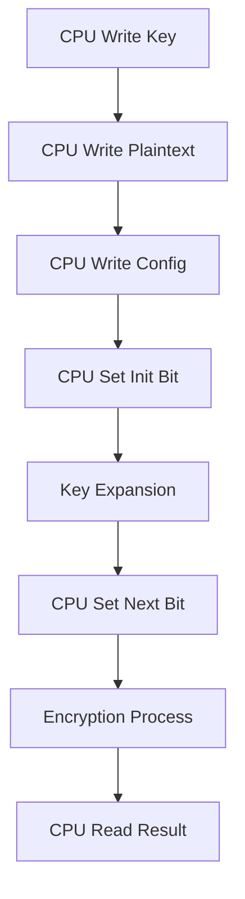
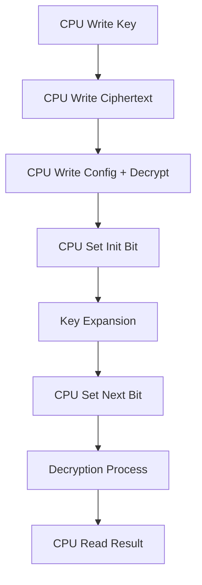

# RTL Module AES - Phân Tích Chi Tiết

## 📋 Tổng Quan

Module `aes.v` là module chính (top-level) của AES Accelerator, tích hợp tất cả các sub-modules để tạo thành một hệ thống AES hoàn chỉnh. Module này implement Wishbone bus interface để giao tiếp với CPU và quản lý toàn bộ quá trình mã hóa/giải mã AES.

---

## 🎯 Chức Năng Chính

### **Core Functions**
- ✅ **AES Encryption**: Mã hóa dữ liệu theo chuẩn AES-128/256
- ✅ **AES Decryption**: Giải mã dữ liệu theo chuẩn AES-128/256
- ✅ **Key Management**: Quản lý khóa và key expansion
- ✅ **Bus Interface**: Wishbone bus interface cho CPU communication
- ✅ **Control Logic**: State machine và control flow

### **Supported Standards**
- **AES-128**: 128-bit key, 10 rounds
- **AES-256**: 256-bit key, 14 rounds
- **ECB Mode**: Electronic Codebook mode
- **NIST FIPS 197**: Tuân thủ chuẩn quốc tế

---

## ⚙️ Parameters và Constants

### **Core Configuration**
```verilog
parameter CTRL_INIT_BIT = 0;        // Bit khởi tạo khóa
parameter CTRL_NEXT_BIT = 1;        // Bit bắt đầu xử lý
parameter CTRL_ENCDEC_BIT = 0;      // Bit chọn mã hóa/giải mã
parameter CTRL_KEYLEN_BIT = 1;      // Bit chọn độ dài khóa
```

### **Status Bits**
```verilog
parameter STATUS_READY_BIT = 0;     // Bit sẵn sàng
parameter STATUS_VALID_BIT = 1;     // Bit kết quả hợp lệ
```

### **Memory Map**
```verilog
parameter CORE_NAME0 = 32'h61657320;    // "aes "
parameter CORE_NAME1 = 32'h20202020;    // "    "
parameter CORE_VERSION = 32'h00060000;  // "0.60"
```

---

## 🔌 Port Interface

### **Clock và Reset**
| Tín Hiệu | Mô Tả | Hướng |
|----------|--------|--------|
| `wb_clk_i` | Wishbone clock | Input |
| `wb_rst_i` | Wishbone reset (active low) | Input |

### **Wishbone Bus Interface**
| Tín Hiệu | Mô Tả | Hướng |
|----------|--------|--------|
| `wbs_stb_i` | Strobe signal | Input |
| `wbs_cyc_i` | Cycle signal | Input |
| `wbs_we_i` | Write enable | Input |
| `wbs_sel_i` | Byte select | Input |
| `wbs_adr_i` | Address bus | Input |
| `wbs_dat_i` | Write data | Input |
| `wbs_dat_o` | Read data | Output |
| `wbs_ack_o` | Acknowledge | Output |

### **Control Interface**
| Tín Hiệu | Mô Tả | Hướng |
|----------|--------|--------|
| `valid` | Valid transaction | Output |
| `we` | Write enable | Output |
| `re` | Read enable | Output |
| `addr` | Register address | Output |
| `wdata` | Write data | Output |
| `rdata` | Read data | Input |

---

## 🏗️ Module Structure

### **Sub-modules Integration**
```verilog
// Key Memory Module
aes_key_mem key_mem (
    .clk(wb_clk_i),
    .reset_n(wb_rst_i),
    .key(key),
    .keylen(keylen),
    .init(init),
    .round(round),
    .round_key(round_key),
    .ready(ready)
);

// Encryption Block
aes_encipher_block encipher (
    .clk(wb_clk_i),
    .reset_n(wb_rst_i),
    .block(block),
    .round_key(round_key),
    .round(round),
    .is_last_round(is_last_round),
    .result(result)
);

// Decryption Block
aes_decipher_block decipher (
    .clk(wb_clk_i),
    .reset_n(wb_rst_i),
    .block(block),
    .round_key(round_key),
    .round(round),
    .is_first_round(is_first_round),
    .result(result)
);
```

### **Core Control Logic**
```verilog
// Main control unit
aes_core core (
    .clk(wb_clk_i),
    .reset_n(wb_rst_i),
    .init(init),
    .next(next),
    .encdec(encdec),
    .keylen(keylen),
    .block(block),
    .key(key),
    .result(result),
    .ready(ready),
    .valid(valid)
);
```

---

## 🧠 Internal Logic

### **Wishbone Interface Logic**
```verilog
// Valid transaction detection
assign valid = wbs_cyc_i && wbs_stb_i;

// Write/Read control
assign we = valid && wbs_we_i;
assign re = valid && !wbs_we_i;

// Address and data routing
assign addr = wbs_adr_i;
assign wdata = wbs_dat_i;
assign wbs_dat_o = rdata;
assign wbs_ack_o = valid;
```

### **Register Access Logic**
```verilog
always @(posedge wb_clk_i or negedge wb_rst_i) begin
    if (!wb_rst_i) begin
        // Reset all registers
        init_reg <= 1'b0;
        next_reg <= 1'b0;
        encdec_reg <= 1'b0;
        keylen_reg <= 1'b0;
    end else if (we) begin
        case (addr)
            // Control register
            8'h08: begin
                init_reg <= wdata[CTRL_INIT_BIT];
                next_reg <= wdata[CTRL_NEXT_BIT];
            end
            // Configuration register
            8'h0A: begin
                encdec_reg <= wdata[CTRL_ENCDEC_BIT];
                keylen_reg <= wdata[CTRL_KEYLEN_BIT];
            end
        endcase
    end
end
```

### **Status Generation**
```verilog
// Status register (read-only)
assign status = {30'b0, valid, ready};

// Ready signal from core
assign ready = core_ready;

// Valid signal from core
assign valid = core_valid;
```

---

## 📊 Memory Map

### **Core Information (Read Only)**
| Địa Chỉ | Tên | Mô Tả | Giá Trị |
|----------|------|--------|---------|
| `0x00` | `CORE_NAME0` | Tên core (32 bit thấp) | `"aes "` |
| `0x01` | `CORE_NAME1` | Tên core (32 bit cao) | `"    "` |
| `0x02` | `CORE_VERSION` | Phiên bản | `"0.60"` |

### **Control Register (0x08) - Write/Read**
| Bit | Tên | Mô Tả | Hướng |
|-----|------|--------|--------|
| 0 | `CTRL_INIT_BIT` | 1 = Khởi tạo khóa | Write |
| 1 | `CTRL_NEXT_BIT` | 1 = Bắt đầu mã hóa/giải mã | Write |
| 2-31 | Reserved | Không sử dụng | - |

### **Status Register (0x09) - Read Only**
| Bit | Tên | Mô Tả |
|-----|------|--------|
| 0 | `STATUS_READY_BIT` | 1 = Core sẵn sàng |
| 1 | `STATUS_VALID_BIT` | 1 = Kết quả hợp lệ |
| 2-31 | Reserved | Không sử dụng |

### **Configuration Register (0x0A) - Write Only**
| Bit | Tên | Mô Tả |
|-----|------|--------|
| 0 | `CTRL_ENCDEC_BIT` | 0 = Mã hóa, 1 = Giải mã |
| 1 | `CTRL_KEYLEN_BIT` | 0 = 128-bit, 1 = 256-bit |
| 2-31 | Reserved | Không sử dụng |

### **Key Registers (0x10-0x17) - Write Only**
| Địa Chỉ | Tên | Mô Tả |
|----------|------|--------|
| `0x10-0x13` | `KEY[0:3]` | Khóa 128-bit (4 words) |
| `0x14-0x17` | `KEY[4:7]` | Khóa 256-bit (4 words thêm) |

### **Data Registers (0x20-0x23) - Write Only**
| Địa Chỉ | Tên | Mô Tả |
|----------|------|--------|
| `0x20-0x23` | `BLOCK[0:3]` | Dữ liệu input (4 words) |

### **Result Registers (0x30-0x33) - Read Only**
| Địa Chỉ | Tên | Mô Tả |
|----------|------|--------|
| `0x30-0x33` | `RESULT[0:3]` | Kết quả output (4 words) |

---

## 🔄 Data Flow

### **Encryption Flow**


### **Decryption Flow**


---

## 📈 Performance Characteristics

### **Throughput**
- **AES-128**: 1 block per ~10 clock cycles
- **AES-256**: 1 block per ~14 clock cycles
- **Key Expansion**: 1 key per ~1 clock cycle

### **Latency**
- **Setup Time**: 1 clock cycle (key loading)
- **Processing Time**: 10-14 clock cycles (encryption/decryption)
- **Total Latency**: 11-15 clock cycles
