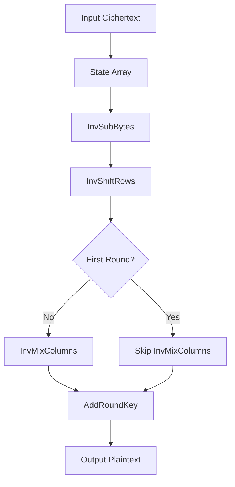

# RTL Module AES Decipher Block - Phân Tích Chi Tiết

## 📋 Tổng Quan

Module `aes_decipher_block.v` là module thực hiện các phép biến đổi giải mã AES theo chuẩn NIST FIPS 197. Module này implement các inverse transformation functions: InvSubBytes, InvShiftRows, InvMixColumns, và AddRoundKey, đảm bảo tính chính xác của quá trình giải mã và mối quan hệ ngược với encryption transformations.

---

## 🎯 Chức Năng Chính

### **Core Functions**
- ✅ **InvSubBytes Transformation**: Thực hiện inverse S-box substitution cho từng byte
- ✅ **InvShiftRows Transformation**: Dịch chuyển ngược các hàng theo pattern AES
- ✅ **InvMixColumns Transformation**: Thực hiện phép nhân ma trận ngược với Galois Field
- ✅ **AddRoundKey**: XOR với round key (giống encryption)
- ✅ **Inverse Relationships**: Đảm bảo mối quan hệ ngược với encryption

### **Supported Standards**
- **AES-128**: 10 rounds decryption
- **AES-256**: 14 rounds decryption
- **NIST FIPS 197**: Tuân thủ chuẩn quốc tế
- **Inverse Transformations**: Các transformation ngược với encryption

---

## ⚙️ Parameters và Constants

### **AES Configuration**
```verilog
parameter AES_128_BIT_KEY = 0;      // 128-bit key mode
parameter AES_256_BIT_KEY = 1;      // 256-bit key mode
parameter NUM_ROUNDS_128 = 10;      // 10 rounds for AES-128
parameter NUM_ROUNDS_256 = 14;      // 14 rounds for AES-256
```

### **Transformation Parameters**
```verilog
parameter BLOCK_SIZE = 128;          // 128-bit block size
parameter BYTE_SIZE = 8;             // 8-bit byte size
parameter NUM_BYTES = 16;            // 16 bytes per block
parameter NUM_ROWS = 4;              // 4 rows in state array
parameter NUM_COLS = 4;              // 4 columns in state array
```

### **Galois Field Constants**
```verilog
parameter GF_POLY = 8'h1B;          // Irreducible polynomial x^8 + x^4 + x^3 + x + 1
parameter GF_ORDER = 256;            // Field order 2^8
```

---

## 🔌 Port Interface

### **Clock và Reset**
| Tín Hiệu | Mô Tả | Hướng |
|----------|--------|--------|
| `clk` | System clock | Input |
| `reset_n` | Reset signal (active low) | Input |

### **Data Interface**
| Tín Hiệu | Mô Tả | Hướng |
|----------|--------|--------|
| `block` | Input block (128-bit) | Input |
| `round_key` | Round key (128-bit) | Input |
| `result` | Output result (128-bit) | Output |

### **Control Interface**
| Tín Hiệu | Mô Tả | Hướng |
|----------|--------|--------|
| `round` | Current round number | Input |
| `is_first_round` | First round indicator | Input |
| `start` | Start processing signal | Input |
| `done` | Processing complete | Output |

### **Debug Interface**
| Tín Hiệu | Mô Tả | Hướng |
|----------|--------|--------|
| `debug_invsubbytes` | InvSubBytes result | Output |
| `debug_invshiftrows` | InvShiftRows result | Output |
| `debug_invmixcolumns` | InvMixColumns result | Output |
| `debug_addroundkey` | AddRoundKey result | Output |

---

## 🏗️ Module Structure

### **Internal Registers**
```verilog
// State array registers (4x4 byte array)
reg [7:0] state [0:3][0:3];        // Current state
reg [7:0] next_state [0:3][0:3];   // Next state

// Control registers
reg start_reg;                       // Start register
reg done_reg;                        // Done register
reg [3:0] round_reg;                // Round register
reg is_first_round_reg;              // First round indicator

// Transformation registers
reg [7:0] invsubbytes_result [0:3][0:3];   // InvSubBytes result
reg [7:0] invshiftrows_result [0:3][0:3];  // InvShiftRows result
reg [7:0] invmixcolumns_result [0:3][0:3]; // InvMixColumns result
reg [7:0] addroundkey_result [0:3][0:3];   // AddRoundKey result
```

### **Inverse S-box Module Integration**
```verilog
// Inverse S-box module for InvSubBytes transformation
aes_inv_sbox inv_sbox (
    .clk(clk),
    .reset_n(reset_n),
    .inv_sboxw(inv_sboxw),
    .new_inv_sboxw(new_inv_sboxw)
);
```

---

## 🧠 Internal Logic

### **Main Control Logic**
```verilog
// Main control state machine
always @(posedge clk or negedge reset_n) begin
    if (!reset_n) begin
        start_reg <= 1'b0;
        done_reg <= 1'b0;
        round_reg <= 4'h0;
        is_first_round_reg <= 1'b0;
    end else begin
        if (start) begin
            start_reg <= 1'b1;
            round_reg <= round;
            is_first_round_reg <= is_first_round;
            done_reg <= 1'b0;
        end else if (start_reg) begin
            // Process transformations
            if (transformation_complete) begin
                done_reg <= 1'b1;
                start_reg <= 1'b0;
            end
        end
    end
end
```

### **State Array Management**
```verilog
// Convert 128-bit block to 4x4 state array
always @(posedge clk) begin
    if (start) begin
        // Row 0: bytes 0-3
        state[0][0] <= block[127:120];
        state[0][1] <= block[119:112];
        state[0][2] <= block[111:104];
        state[0][3] <= block[103:96];
        
        // Row 1: bytes 4-7
        state[1][0] <= block[95:88];
        state[1][1] <= block[87:80];
        state[1][2] <= block[79:72];
        state[1][3] <= block[71:64];
        
        // Row 2: bytes 8-11
        state[2][0] <= block[63:56];
        state[2][1] <= block[55:48];
        state[2][2] <= block[47:40];
        state[2][3] <= block[39:32];
        
        // Row 3: bytes 12-15
        state[3][0] <= block[31:24];
        state[3][1] <= block[23:16];
        state[3][2] <= block[15:8];
        state[3][3] <= block[7:0];
    end
end
```

---

## 🔄 Inverse Transformation Functions

### **1. InvSubBytes Transformation**
```verilog
// InvSubBytes transformation for each byte
always @(posedge clk) begin
    if (start_reg) begin
        // Apply inverse S-box to each byte
        for (int i = 0; i < 4; i++) begin
            for (int j = 0; j < 4; j++) begin
                invsubbytes_result[i][j] <= inv_sbox_lookup(state[i][j]);
            end
        end
    end
end

// Inverse S-box lookup function
function [7:0] inv_sbox_lookup;
    input [7:0] byte_in;
    begin
        case (byte_in)
            8'h00: inv_sbox_lookup = 8'h52;
            8'h01: inv_sbox_lookup = 8'h09;
            8'h02: inv_sbox_lookup = 8'h6A;
            // ... more inverse S-box values
            8'hFF: inv_sbox_lookup = 8'h7C;
            default: inv_sbox_lookup = 8'h00;
        endcase
    end
endfunction
```

### **2. InvShiftRows Transformation**
```verilog
// InvShiftRows transformation (reverse of ShiftRows)
always @(posedge clk) begin
    if (start_reg) begin
        // Row 0: no shift
        invshiftrows_result[0][0] <= invsubbytes_result[0][0];
        invshiftrows_result[0][1] <= invsubbytes_result[0][1];
        invshiftrows_result[0][2] <= invsubbytes_result[0][2];
        invshiftrows_result[0][3] <= invsubbytes_result[0][3];
        
        // Row 1: right shift by 1 (reverse of left shift by 1)
        invshiftrows_result[1][0] <= invsubbytes_result[1][3];
        invshiftrows_result[1][1] <= invsubbytes_result[1][0];
        invshiftrows_result[1][2] <= invsubbytes_result[1][1];
        invshiftrows_result[1][3] <= invsubbytes_result[1][2];
        
        // Row 2: right shift by 2 (reverse of left shift by 2)
        invshiftrows_result[2][0] <= invsubbytes_result[2][2];
        invshiftrows_result[2][1] <= invsubbytes_result[2][3];
        invshiftrows_result[2][2] <= invsubbytes_result[2][0];
        invshiftrows_result[2][3] <= invsubbytes_result[2][1];
        
        // Row 3: right shift by 3 (reverse of left shift by 3)
        invshiftrows_result[3][0] <= invsubbytes_result[3][1];
        invshiftrows_result[3][1] <= invsubbytes_result[3][2];
        invshiftrows_result[3][2] <= invsubbytes_result[3][3];
        invshiftrows_result[3][3] <= invsubbytes_result[3][0];
    end
end
```

### **3. InvMixColumns Transformation**
```verilog
// InvMixColumns transformation using Galois Field arithmetic
always @(posedge clk) begin
    if (start_reg && !is_first_round_reg) begin
        // Apply InvMixColumns to each column
        for (int j = 0; j < 4; j++) begin
            // Column j inverse transformation
            invmixcolumns_result[0][j] <= gm14(invshiftrows_result[0][j]) ^ 
                                         gm11(invshiftrows_result[1][j]) ^ 
                                         gm13(invshiftrows_result[2][j]) ^ 
                                         gm9(invshiftrows_result[3][j]);
            
            invmixcolumns_result[1][j] <= gm9(invshiftrows_result[0][j]) ^ 
                                         gm14(invshiftrows_result[1][j]) ^ 
                                         gm11(invshiftrows_result[2][j]) ^ 
                                         gm13(invshiftrows_result[3][j]);
            
            invmixcolumns_result[2][j] <= gm13(invshiftrows_result[0][j]) ^ 
                                         gm9(invshiftrows_result[1][j]) ^ 
                                         gm14(invshiftrows_result[2][j]) ^ 
                                         gm11(invshiftrows_result[3][j]);
            
            invmixcolumns_result[3][j] <= gm11(invshiftrows_result[0][j]) ^ 
                                         gm13(invshiftrows_result[1][j]) ^ 
                                         gm9(invshiftrows_result[2][j]) ^ 
                                         gm14(invshiftrows_result[3][j]);
        end
    end else if (start_reg && is_first_round_reg) begin
        // First round: no InvMixColumns
        for (int i = 0; i < 4; i++) begin
            for (int j = 0; j < 4; j++) begin
                invmixcolumns_result[i][j] <= invshiftrows_result[i][j];
            end
        end
    end
end
```

### **4. AddRoundKey Transformation**
```verilog
// AddRoundKey transformation (same as encryption)
always @(posedge clk) begin
    if (start_reg) begin
        // XOR with round key
        for (int i = 0; i < 4; i++) begin
            for (int j = 0; j < 4; j++) begin
                addroundkey_result[i][j] <= invmixcolumns_result[i][j] ^ 
                                          round_key_byte(i, j);
            end
        end
    end
end

// Extract byte from round key (same as encryption)
function [7:0] round_key_byte;
    input [1:0] row, col;
    begin
        case ({row, col})
            4'b0000: round_key_byte = round_key[127:120];
            4'b0001: round_key_byte = round_key[119:112];
            4'b0010: round_key_byte = round_key[111:104];
            4'b0011: round_key_byte = round_key[103:96];
            4'b0100: round_key_byte = round_key[95:88];
            4'b0101: round_key_byte = round_key[87:80];
            4'b0110: round_key_byte = round_key[79:72];
            4'b0111: round_key_byte = round_key[71:64];
            4'b1000: round_key_byte = round_key[63:56];
            4'b1001: round_key_byte = round_key[55:48];
            4'b1010: round_key_byte = round_key[47:40];
            4'b1011: round_key_byte = round_key[39:32];
            4'b1100: round_key_byte = round_key[31:24];
            4'b1101: round_key_byte = round_key[23:16];
            4'b1110: round_key_byte = round_key[15:8];
            4'b1111: round_key_byte = round_key[7:0];
        endcase
    end
endfunction
```

---

## 🔢 Inverse Galois Field Arithmetic

### **gm9 Function (Multiply by 9)**
```verilog
// Galois Field multiplication by 9 (x^3 + 1)
function [7:0] gm9;
    input [7:0] byte_in;
    begin
        // gm9 = gm8 ^ byte_in = (x^3) ^ 1
        gm9 = gm8(byte_in) ^ byte_in;
    end
endfunction
```

### **gm11 Function (Multiply by 11)**
```verilog
// Galois Field multiplication by 11 (x^3 + x + 1)
function [7:0] gm11;
    input [7:0] byte_in;
    begin
        // gm11 = gm8 ^ gm2 ^ byte_in = (x^3) ^ x ^ 1
        gm11 = gm8(byte_in) ^ gm2(byte_in) ^ byte_in;
    end
endfunction
```

### **gm13 Function (Multiply by 13)**
```verilog
// Galois Field multiplication by 13 (x^3 + x^2 + 1)
function [7:0] gm13;
    input [7:0] byte_in;
    begin
        // gm13 = gm8 ^ gm4 ^ byte_in = (x^3) ^ (x^2) ^ 1
        gm13 = gm8(byte_in) ^ gm4(byte_in) ^ byte_in;
    end
endfunction
```

### **gm14 Function (Multiply by 14)**
```verilog
// Galois Field multiplication by 14 (x^3 + x^2 + x)
function [7:0] gm14;
    input [7:0] byte_in;
    begin
        // gm14 = gm8 ^ gm4 ^ gm2 = (x^3) ^ (x^2) ^ x
        gm14 = gm8(byte_in) ^ gm4(byte_in) ^ gm2(byte_in);
    end
endfunction
```

### **Helper Functions**
```verilog
// Galois Field multiplication by 4 (x^2)
function [7:0] gm4;
    input [7:0] byte_in;
    begin
        gm4 = gm2(gm2(byte_in));
    end
endfunction

// Galois Field multiplication by 8 (x^3)
function [7:0] gm8;
    input [7:0] byte_in;
    begin
        gm8 = gm2(gm4(byte_in));
    end
endfunction
```

---

## 🔄 Data Flow

### **Inverse Transformation Flow**


### **Round Processing (Reverse Order)**
```verilog
// Round processing logic (reverse order from encryption)
always @(posedge clk) begin
    if (start_reg) begin
        // Apply inverse transformations in sequence
        // 1. InvSubBytes
        // 2. InvShiftRows  
        // 3. InvMixColumns (if not first round)
        // 4. AddRoundKey
        
        if (transformation_complete) begin
            // Convert result back to 128-bit output
            result <= {addroundkey_result[0][0], addroundkey_result[0][1],
                      addroundkey_result[0][2], addroundkey_result[0][3],
                      addroundkey_result[1][0], addroundkey_result[1][1],
                      addroundkey_result[1][2], addroundkey_result[1][3],
                      addroundkey_result[2][0], addroundkey_result[2][1],
                      addroundkey_result[2][2], addroundkey_result[2][3],
                      addroundkey_result[3][0], addroundkey_result[3][1],
                      addroundkey_result[3][2], addroundkey_result[3][3]};
        end
    end
end
```

---

## 📈 Performance Characteristics

### **Throughput**
- **Single Round**: 1 round per clock cycle
- **AES-128**: 10 rounds in 10 clock cycles
- **AES-256**: 14 rounds in 14 clock cycles

### **Latency**
- **Setup Time**: 1 clock cycle (data loading)
- **Processing Time**: 1 clock cycle (transformation)
- **Total Latency**: 2 clock cycles per round

### **Resource Usage**
- **Flip-flops**: ~150-200 (state arrays + control)
- **Combinational Logic**: ~400-600 LUTs (more complex than encryption)
- **Memory**: 0 (uses registers)

---

**[🏗️ Step 2 - RTL design](02_rtl_design.md)** - Kiến trúc RTL và luồng thực thi CPU
