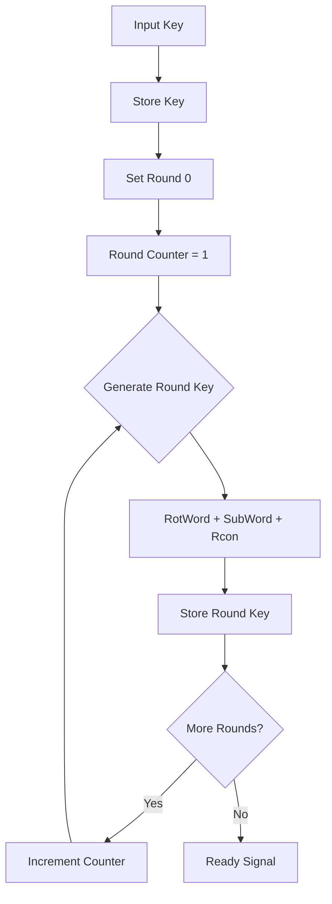
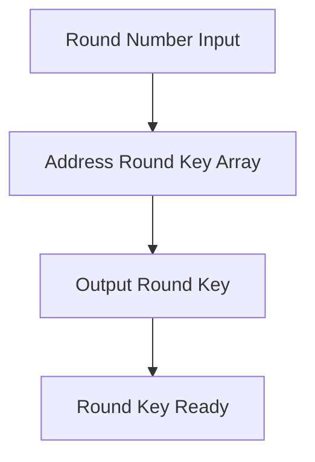

# RTL Module AES Key Memory - Phân Tích Chi Tiết

## 📋 Tổng Quan

Module `aes_key_mem.v` là module quản lý khóa và thực hiện key expansion cho AES Accelerator. Module này implement thuật toán key expansion theo chuẩn NIST FIPS 197, tạo ra các round keys cần thiết cho quá trình mã hóa/giải mã AES-128 và AES-256.

---

## 🎯 Chức Năng Chính

### **Core Functions**
- ✅ **Key Storage**: Lưu trữ khóa chính (128-bit hoặc 256-bit)
- ✅ **Key Expansion**: Tạo ra các round keys theo thuật toán AES
- ✅ **S-box Integration**: Tích hợp S-box transformation trong key expansion
- ✅ **Round Key Generation**: Tạo round key cho từng round
- ✅ **Key Length Support**: Hỗ trợ cả AES-128 và AES-256

### **Supported Standards**
- **AES-128**: 128-bit key, 11 round keys (0-10)
- **AES-256**: 256-bit key, 15 round keys (0-14)
- **NIST FIPS 197**: Tuân thủ chuẩn quốc tế
- **Rcon Constants**: Sử dụng round constants chuẩn

---

## ⚙️ Parameters và Constants

### **Key Length Parameters**
```verilog
parameter AES_128_BIT_KEY = 0;      // 128-bit key mode
parameter AES_256_BIT_KEY = 1;      // 256-bit key mode
parameter AES_128_NUM_ROUNDS = 10;  // 10 rounds for AES-128
parameter AES_256_NUM_ROUNDS = 14;  // 14 rounds for AES-256
```

### **Round Constants (Rcon)**
```verilog
// Round constants for key expansion
parameter [31:0] RCON_1 = 32'h01000000;
parameter [31:0] RCON_2 = 32'h02000000;
parameter [31:0] RCON_3 = 32'h04000000;
parameter [31:0] RCON_4 = 32'h08000000;
parameter [31:0] RCON_5 = 32'h10000000;
parameter [31:0] RCON_6 = 32'h20000000;
parameter [31:0] RCON_7 = 32'h40000000;
parameter [31:0] RCON_8 = 32'h80000000;
parameter [31:0] RCON_9 = 32'h1B000000;
parameter [31:0] RCON_10 = 32'h36000000;
```

### **Memory Parameters**
```verilog
parameter KEY_MEMORY_SIZE = 256;    // 256-bit key storage
parameter ROUND_KEY_SIZE = 128;     // 128-bit round key
parameter MAX_ROUNDS = 15;          // Maximum number of rounds
```

---

## 🔌 Port Interface

### **Clock và Reset**
| Tín Hiệu | Mô Tả | Hướng |
|----------|--------|--------|
| `clk` | System clock | Input |
| `reset_n` | Reset signal (active low) | Input |

### **Key Interface**
| Tín Hiệu | Mô Tả | Hướng |
|----------|--------|--------|
| `key` | Input key (256-bit) | Input |
| `keylen` | Key length (0=128-bit, 1=256-bit) | Input |
| `init` | Initialize signal | Input |

### **Round Key Interface**
| Tín Hiệu | Mô Tả | Hướng |
|----------|--------|--------|
| `round` | Round number | Input |
| `round_key` | Round key output (128-bit) | Output |
| `ready` | Ready signal | Output |

### **S-box Interface**
| Tín Hiệu | Mô Tả | Hướng |
|----------|--------|--------|
| `sboxw` | S-box input word | Output |
| `new_sboxw` | S-box output word | Input |

---

## 🏗️ Module Structure

### **Internal Registers**
```verilog
// Key storage registers
reg [255:0] key_reg;               // Stored key
reg [127:0] round_keys [0:14];     // Round key array
reg [3:0] keylen_reg;              // Key length register

// Control registers
reg init_reg;                       // Initialize register
reg ready_reg;                      // Ready status register

// Key expansion registers
reg [31:0] temp_word;              // Temporary word for expansion
reg [31:0] rot_word;               // Rotated word
reg [31:0] sub_word;               // Substituted word
reg [3:0] round_ctr;               // Round counter
reg [3:0] max_rounds;              // Maximum rounds
```

### **S-box Module Integration**
```verilog
// S-box module for SubBytes transformation
aes_sbox sbox (
    .clk(clk),
    .reset_n(reset_n),
    .sboxw(sboxw),
    .new_sboxw(new_sboxw)
);
```

---

## 🧠 Internal Logic

### **Key Storage Logic**
```verilog
// Key storage and key length detection
always @(posedge clk or negedge reset_n) begin
    if (!reset_n) begin
        key_reg <= 256'h0;
        keylen_reg <= AES_128_BIT_KEY;
        ready_reg <= 1'b0;
    end else begin
        if (init) begin
            key_reg <= key;
            keylen_reg <= keylen;
            ready_reg <= 1'b0;
        end else if (key_expansion_done) begin
            ready_reg <= 1'b1;
        end
    end
end
```

### **Key Expansion Algorithm**
```verilog
// Key expansion state machine
always @(posedge clk or negedge reset_n) begin
    if (!reset_n) begin
        round_ctr <= 4'h0;
        max_rounds <= 4'd10;
    end else begin
        if (init) begin
            round_ctr <= 4'h0;
            // Set max rounds based on key length
            if (keylen == AES_128_BIT_KEY) begin
                max_rounds <= 4'd10;  // AES-128: 10 rounds
            end else begin
                max_rounds <= 4'd14;  // AES-256: 14 rounds
            end
        end else if (round_ctr < max_rounds) begin
            round_ctr <= round_ctr + 1;
        end
    end
end
```

### **Round Key Generation**
```verilog
// Round key generation logic
always @(posedge clk) begin
    if (init) begin
        // Store initial key as round key 0
        round_keys[0] <= key[127:0];
        if (keylen == AES_256_BIT_KEY) begin
            round_keys[1] <= key[255:128];
        end
    end else if (round_ctr > 0 && round_ctr <= max_rounds) begin
        // Generate next round key
        case (keylen_reg)
            AES_128_BIT_KEY: begin
                round_keys[round_ctr] <= generate_round_key_128(round_ctr);
            end
            AES_256_BIT_KEY: begin
                round_keys[round_ctr] <= generate_round_key_256(round_ctr);
            end
        endcase
    end
end
```

---

## 🔑 Key Expansion Algorithm

### **AES-128 Key Expansion**
```verilog
// AES-128 key expansion function
function [127:0] generate_round_key_128;
    input [3:0] round_num;
    reg [31:0] temp_word;
    reg [31:0] rot_word;
    reg [31:0] sub_word;
    reg [31:0] rcon;
    begin
        // Get previous round key words
        temp_word = round_keys[round_num-1][31:0];
        
        // RotWord operation
        rot_word = {temp_word[23:0], temp_word[31:24]};
        
        // SubWord operation (using S-box)
        sub_word = {sub_byte(rot_word[31:24]), 
                   sub_byte(rot_word[23:16]),
                   sub_byte(rot_word[15:8]), 
                   sub_byte(rot_word[7:0])};
        
        // XOR with Rcon
        case (round_num)
            4'h1: rcon = RCON_1;
            4'h2: rcon = RCON_2;
            4'h3: rcon = RCON_3;
            4'h4: rcon = RCON_4;
            4'h5: rcon = RCON_5;
            4'h6: rcon = RCON_6;
            4'h7: rcon = RCON_7;
            4'h8: rcon = RCON_8;
            4'h9: rcon = RCON_9;
            4'hA: rcon = RCON_10;
            default: rcon = 32'h0;
        endcase
        
        sub_word = sub_word ^ rcon;
        
        // Generate new round key
        generate_round_key_128 = {round_keys[round_num-1][127:32] ^ sub_word,
                                 round_keys[round_num-1][31:0] ^ 
                                 (round_keys[round_num-1][127:32] ^ sub_word)};
    end
endfunction
```

### **AES-256 Key Expansion**
```verilog
// AES-256 key expansion function
function [127:0] generate_round_key_256;
    input [3:0] round_num;
    reg [31:0] temp_word;
    reg [31:0] rot_word;
    reg [31:0] sub_word;
    reg [31:0] rcon;
    begin
        if (round_num[0] == 1'b0) begin
            // Even rounds: similar to AES-128
            temp_word = round_keys[round_num-1][31:0];
            rot_word = {temp_word[23:0], temp_word[31:24]};
            sub_word = {sub_byte(rot_word[31:24]), 
                       sub_byte(rot_word[23:16]),
                       sub_byte(rot_word[15:8]), 
                       sub_byte(rot_word[7:0])};
            
            case (round_num >> 1)
                4'h1: rcon = RCON_1;
                4'h2: rcon = RCON_2;
                4'h3: rcon = RCON_3;
                4'h4: rcon = RCON_4;
                4'h5: rcon = RCON_5;
                4'h6: rcon = RCON_6;
                4'h7: rcon = RCON_7;
                default: rcon = 32'h0;
            endcase
            
            sub_word = sub_word ^ rcon;
            
            generate_round_key_256 = {round_keys[round_num-1][127:32] ^ sub_word,
                                     round_keys[round_num-1][31:0] ^ 
                                     (round_keys[round_num-1][127:32] ^ sub_word)};
        end else begin
            // Odd rounds: simple XOR
            generate_round_key_256 = round_keys[round_num-1] ^ 
                                   {round_keys[round_num-2][127:32], 
                                    round_keys[round_num-2][31:0]};
        end
    end
endfunction
```

---

## 🔄 Data Flow

### **Key Expansion Flow**


### **Round Key Access Flow**


---

## 📈 Performance Characteristics

### **Throughput**
- **Key Expansion**: 1 round key per clock cycle
- **AES-128**: 11 round keys in 11 clock cycles
- **AES-256**: 15 round keys in 15 clock cycles

### **Latency**
- **Setup Time**: 1 clock cycle (key loading)
- **Expansion Time**: 10-14 clock cycles (round key generation)
- **Total Latency**: 11-15 clock cycles

### **Resource Usage**
- **Flip-flops**: ~200-300 (key storage + round keys)
- **Combinational Logic**: ~100-200 LUTs
- **Memory**: ~2-3 Kb (round key storage)
