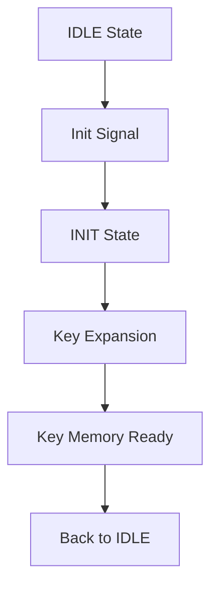
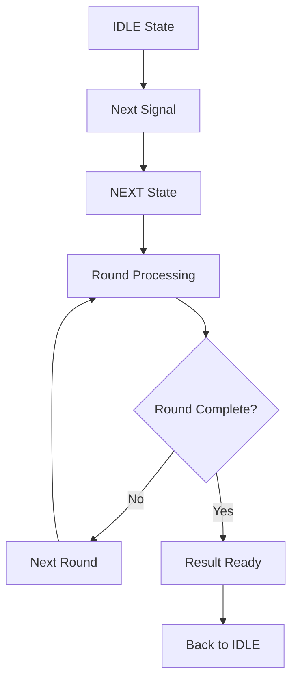

# RTL Module AES Core - Phân Tích Chi Tiết

## 📋 Tổng Quan

Module `aes_core.v` là module điều khiển trung tâm của AES Accelerator, quản lý state machine và điều phối hoạt động giữa các sub-modules. Module này implement control logic chính để thực hiện quá trình mã hóa/giải mã AES theo đúng chuẩn NIST FIPS 197.

---

## 🎯 Chức Năng Chính

### **Core Functions**
- ✅ **State Machine Control**: Quản lý trạng thái và transitions
- ✅ **Key Expansion Control**: Điều khiển quá trình tạo khóa con
- ✅ **Encryption/Decryption Control**: Điều phối quá trình mã hóa/giải mã
- ✅ **Module Coordination**: Điều phối hoạt động giữa các sub-modules
- ✅ **Timing Control**: Quản lý timing và synchronization

### **Supported Operations**
- **AES-128**: 128-bit key, 10 rounds encryption/decryption
- **AES-256**: 256-bit key, 14 rounds encryption/decryption
- **Key Expansion**: Tự động tạo round keys
- **Mode Switching**: Chuyển đổi giữa encryption và decryption

---

## ⚙️ Parameters và Constants

### **State Machine Parameters**
```verilog
parameter CTRL_IDLE = 2'b00;    // Idle state - chờ lệnh
parameter CTRL_INIT = 2'b01;    // Initialize state - khởi tạo khóa
parameter CTRL_NEXT = 2'b10;    // Next state - xử lý dữ liệu
parameter CTRL_ERROR = 2'b11;   // Error state - xử lý lỗi
```

### **AES Configuration**
```verilog
parameter AES_128_BIT_KEY = 0;  // 128-bit key mode
parameter AES_256_BIT_KEY = 1;  // 256-bit key mode
parameter ENCRYPT_MODE = 0;     // Encryption mode
parameter DECRYPT_MODE = 1;     // Decryption mode
```

### **Timing Parameters**
```verilog
parameter INIT_DELAY = 2;       // Delay cho key expansion
parameter PROCESS_DELAY = 1;    // Delay cho mỗi round
```

---

## 🔌 Port Interface

### **Clock và Reset**
| Tín Hiệu | Mô Tả | Hướng |
|----------|--------|--------|
| `clk` | System clock | Input |
| `reset_n` | Reset signal (active low) | Input |

### **Control Interface**
| Tín Hiệu | Mô Tả | Hướng |
|----------|--------|--------|
| `init` | Initialize signal | Input |
| `next` | Next signal | Input |
| `encdec` | Encrypt/Decrypt mode | Input |
| `keylen` | Key length (0=128-bit, 1=256-bit) | Input |

### **Data Interface**
| Tín Hiệu | Mô Tả | Hướng |
|----------|--------|--------|
| `block` | Input block (128-bit) | Input |
| `key` | Input key (256-bit) | Input |
| `result` | Output result (128-bit) | Output |

### **Status Interface**
| Tín Hiệu | Mô Tả | Hướng |
|----------|--------|--------|
| `ready` | Ready signal | Output |
| `valid` | Valid result signal | Output |

### **Module Interface**
| Tín Hiệu | Mô Tả | Hướng |
|----------|--------|--------|
| `key_mem_init` | Key memory init signal | Output |
| `key_mem_round` | Round number for key memory | Output |
| `key_mem_ready` | Key memory ready signal | Input |
| `round_key` | Round key from key memory | Input |
| `encipher_start` | Start encryption signal | Output |
| `encipher_done` | Encryption complete signal | Input |
| `decipher_start` | Start decryption signal | Output |
| `decipher_done` | Decryption complete signal | Input |

---

## 🏗️ Module Structure

### **Internal Registers**
```verilog
// State machine register
reg [1:0] state_reg;
reg [1:0] next_state;

// Control registers
reg init_reg;
reg next_reg;
reg encdec_reg;
reg keylen_reg;

// Data registers
reg [127:0] block_reg;
reg [255:0] key_reg;
reg [127:0] result_reg;

// Round counter
reg [3:0] round_ctr;
reg [3:0] max_rounds;

// Status registers
reg ready_reg;
reg valid_reg;
```

### **Sub-module Instantiations**
```verilog
// Key Memory Module
aes_key_mem key_mem (
    .clk(clk),
    .reset_n(reset_n),
    .key(key_reg),
    .keylen(keylen_reg),
    .init(key_mem_init),
    .round(key_mem_round),
    .round_key(round_key),
    .ready(key_mem_ready)
);

// Encryption Block
aes_encipher_block encipher (
    .clk(clk),
    .reset_n(reset_n),
    .block(block_reg),
    .round_key(round_key),
    .round(round_ctr),
    .is_last_round(round_ctr == max_rounds),
    .start(encipher_start),
    .done(encipher_done),
    .result(encipher_result)
);

// Decryption Block
aes_decipher_block decipher (
    .clk(clk),
    .reset_n(reset_n),
    .block(block_reg),
    .round_key(round_key),
    .round(round_ctr),
    .is_first_round(round_ctr == 0),
    .start(decipher_start),
    .done(decipher_done),
    .result(decipher_result)
);
```

---

## 🧠 Internal Logic

### **State Machine Logic**
```verilog
// State machine sequential logic
always @(posedge clk or negedge reset_n) begin
    if (!reset_n) begin
        state_reg <= CTRL_IDLE;
    end else begin
        state_reg <= next_state;
    end
end

// State machine combinational logic
always @* begin
    case (state_reg)
        CTRL_IDLE: begin
            if (init) begin
                next_state = CTRL_INIT;
            end else if (next) begin
                next_state = CTRL_NEXT;
            end else begin
                next_state = CTRL_IDLE;
            end
        end
        
        CTRL_INIT: begin
            if (key_mem_ready) begin
                next_state = CTRL_IDLE;
            end else begin
                next_state = CTRL_INIT;
            end
        end
        
        CTRL_NEXT: begin
            if (encipher_done || decipher_done) begin
                next_state = CTRL_IDLE;
            end else begin
                next_state = CTRL_NEXT;
            end
        end
        
        default: next_state = CTRL_IDLE;
    endcase
end
```

### **Control Logic**
```verilog
// Control signal generation
always @(posedge clk or negedge reset_n) begin
    if (!reset_n) begin
        init_reg <= 1'b0;
        next_reg <= 1'b0;
        encdec_reg <= 1'b0;
        keylen_reg <= 1'b0;
        block_reg <= 128'h0;
        key_reg <= 256'h0;
        round_ctr <= 4'h0;
        ready_reg <= 1'b0;
        valid_reg <= 1'b0;
    end else begin
        // Update control registers
        if (state_reg == CTRL_IDLE) begin
            init_reg <= init;
            next_reg <= next;
            encdec_reg <= encdec;
            keylen_reg <= keylen;
            block_reg <= block;
            key_reg <= key;
        end
        
        // Update round counter
        if (state_reg == CTRL_NEXT) begin
            if (encipher_done || decipher_done) begin
                round_ctr <= round_ctr + 1;
            end
        end
        
        // Update status
        ready_reg <= (state_reg == CTRL_IDLE);
        valid_reg <= (round_ctr == max_rounds) && 
                    (encipher_done || decipher_done);
    end
end
```

### **Round Control Logic**
```verilog
// Round control
always @(posedge clk) begin
    if (state_reg == CTRL_INIT) begin
        // Set max rounds based on key length
        if (keylen_reg == AES_128_BIT_KEY) begin
            max_rounds <= 4'd10;  // AES-128: 10 rounds
        end else begin
            max_rounds <= 4'd14;  // AES-256: 14 rounds
        end
        round_ctr <= 4'h0;
    end
end

// Key memory control
assign key_mem_init = (state_reg == CTRL_INIT);
assign key_mem_round = round_ctr;

// Encryption/Decryption control
assign encipher_start = (state_reg == CTRL_NEXT) && 
                       (encdec_reg == ENCRYPT_MODE) && 
                       (round_ctr == 0);
assign decipher_start = (state_reg == CTRL_NEXT) && 
                       (encdec_reg == DECRYPT_MODE) && 
                       (round_ctr == max_rounds);
```

---

## 🔄 Data Flow

### **Initialization Flow**


### **Processing Flow**


### **Round Processing**
```verilog
// Round processing logic
always @(posedge clk) begin
    if (state_reg == CTRL_NEXT) begin
        case (encdec_reg)
            ENCRYPT_MODE: begin
                if (encipher_done) begin
                    if (round_ctr < max_rounds) begin
                        round_ctr <= round_ctr + 1;
                    end else begin
                        result_reg <= encipher_result;
                    end
                end
            end
            
            DECRYPT_MODE: begin
                if (decipher_done) begin
                    if (round_ctr > 0) begin
                        round_ctr <= round_ctr - 1;
                    end else begin
                        result_reg <= decipher_result;
                    end
                end
            end
        endcase
    end
end
```

---

## 📈 Performance Characteristics

### **Throughput**
- **AES-128**: 1 block per ~10 clock cycles
- **AES-256**: 1 block per ~14 clock cycles
- **Key Expansion**: 1 key per ~2 clock cycles

### **Latency**
- **Setup Time**: 1 clock cycle (control signal setup)
- **Processing Time**: 10-14 clock cycles (round processing)
- **Total Latency**: 11-15 clock cycles

### **Resource Usage**
- **Flip-flops**: ~50-100 (depending on implementation)
- **Combinational Logic**: ~200-400 LUTs
- **Memory**: 0 (uses external key memory)
