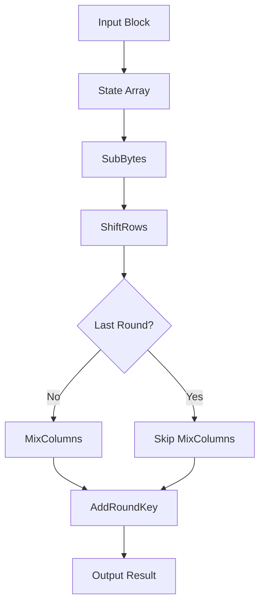

# RTL Module AES Encipher Block - Phân Tích Chi Tiết

## 📋 Tổng Quan

Module `aes_encipher_block.v` là module thực hiện các phép biến đổi mã hóa AES theo chuẩn NIST FIPS 197. Module này implement các transformation functions: SubBytes, ShiftRows, MixColumns, và AddRoundKey, cùng với các hàm Galois Field arithmetic (gm2, gm3) cần thiết cho MixColumns transformation.

---

## 🎯 Chức Năng Chính

### **Core Functions**
- ✅ **SubBytes Transformation**: Thực hiện S-box substitution cho từng byte
- ✅ **ShiftRows Transformation**: Dịch chuyển các hàng theo pattern AES
- ✅ **MixColumns Transformation**: Thực hiện phép nhân ma trận với Galois Field
- ✅ **AddRoundKey**: XOR với round key
- ✅ **Galois Field Arithmetic**: Các hàm gm2, gm3 cho GF(2^8)

### **Supported Standards**
- **AES-128**: 10 rounds encryption
- **AES-256**: 14 rounds encryption
- **NIST FIPS 197**: Tuân thủ chuẩn quốc tế
- **GF(2^8) Arithmetic**: Galois Field arithmetic chuẩn

---

## ⚙️ Parameters và Constants

### **AES Configuration**
```verilog
parameter AES_128_BIT_KEY = 0;      // 128-bit key mode
parameter AES_256_BIT_KEY = 1;      // 256-bit key mode
parameter NUM_ROUNDS_128 = 10;      // 10 rounds for AES-128
parameter NUM_ROUNDS_256 = 14;      // 14 rounds for AES-256
```

### **Transformation Parameters**
```verilog
parameter BLOCK_SIZE = 128;          // 128-bit block size
parameter BYTE_SIZE = 8;             // 8-bit byte size
parameter NUM_BYTES = 16;            // 16 bytes per block
parameter NUM_ROWS = 4;              // 4 rows in state array
parameter NUM_COLS = 4;              // 4 columns in state array
```

### **Galois Field Constants**
```verilog
parameter GF_POLY = 8'h1B;          // Irreducible polynomial x^8 + x^4 + x^3 + x + 1
parameter GF_ORDER = 256;            // Field order 2^8
```

---

## 🔌 Port Interface

### **Clock và Reset**
| Tín Hiệu | Mô Tả | Hướng |
|----------|--------|--------|
| `clk` | System clock | Input |
| `reset_n` | Reset signal (active low) | Input |

### **Data Interface**
| Tín Hiệu | Mô Tả | Hướng |
|----------|--------|--------|
| `block` | Input block (128-bit) | Input |
| `round_key` | Round key (128-bit) | Input |
| `result` | Output result (128-bit) | Output |

### **Control Interface**
| Tín Hiệu | Mô Tả | Hướng |
|----------|--------|--------|
| `round` | Current round number | Input |
| `is_last_round` | Last round indicator | Input |
| `start` | Start processing signal | Input |
| `done` | Processing complete | Output |

### **Debug Interface**
| Tín Hiệu | Mô Tả | Hướng |
|----------|--------|--------|
| `debug_subbytes` | SubBytes result | Output |
| `debug_shiftrows` | ShiftRows result | Output |
| `debug_mixcolumns` | MixColumns result | Output |
| `debug_addroundkey` | AddRoundKey result | Output |

---

## 🏗️ Module Structure

### **Internal Registers**
```verilog
// State array registers (4x4 byte array)
reg [7:0] state [0:3][0:3];        // Current state
reg [7:0] next_state [0:3][0:3];   // Next state

// Control registers
reg start_reg;                       // Start register
reg done_reg;                        // Done register
reg [3:0] round_reg;                // Round register
reg is_last_round_reg;               // Last round indicator

// Transformation registers
reg [7:0] subbytes_result [0:3][0:3];   // SubBytes result
reg [7:0] shiftrows_result [0:3][0:3];  // ShiftRows result
reg [7:0] mixcolumns_result [0:3][0:3]; // MixColumns result
reg [7:0] addroundkey_result [0:3][0:3]; // AddRoundKey result
```

### **S-box Module Integration**
```verilog
// S-box module for SubBytes transformation
aes_sbox sbox (
    .clk(clk),
    .reset_n(reset_n),
    .sboxw(sboxw),
    .new_sboxw(new_sboxw)
);
```

---

## 🧠 Internal Logic

### **Main Control Logic**
```verilog
// Main control state machine
always @(posedge clk or negedge reset_n) begin
    if (!reset_n) begin
        start_reg <= 1'b0;
        done_reg <= 1'b0;
        round_reg <= 4'h0;
        is_last_round_reg <= 1'b0;
    end else begin
        if (start) begin
            start_reg <= 1'b1;
            round_reg <= round;
            is_last_round_reg <= is_last_round;
            done_reg <= 1'b0;
        end else if (start_reg) begin
            // Process transformations
            if (transformation_complete) begin
                done_reg <= 1'b1;
                start_reg <= 1'b0;
            end
        end
    end
end
```

### **State Array Management**
```verilog
// Convert 128-bit block to 4x4 state array
always @(posedge clk) begin
    if (start) begin
        // Row 0: bytes 0-3
        state[0][0] <= block[127:120];
        state[0][1] <= block[119:112];
        state[0][2] <= block[111:104];
        state[0][3] <= block[103:96];
        
        // Row 1: bytes 4-7
        state[1][0] <= block[95:88];
        state[1][1] <= block[87:80];
        state[1][2] <= block[79:72];
        state[1][3] <= block[71:64];
        
        // Row 2: bytes 8-11
        state[2][0] <= block[63:56];
        state[2][1] <= block[55:48];
        state[2][2] <= block[47:40];
        state[2][3] <= block[39:32];
        
        // Row 3: bytes 12-15
        state[3][0] <= block[31:24];
        state[3][1] <= block[23:16];
        state[3][2] <= block[15:8];
        state[3][3] <= block[7:0];
    end
end
```

---

## 🔄 Transformation Functions

### **1. SubBytes Transformation**
```verilog
// SubBytes transformation for each byte
always @(posedge clk) begin
    if (start_reg) begin
        // Apply S-box to each byte
        for (int i = 0; i < 4; i++) begin
            for (int j = 0; j < 4; j++) begin
                subbytes_result[i][j] <= sbox_lookup(state[i][j]);
            end
        end
    end
end

// S-box lookup function
function [7:0] sbox_lookup;
    input [7:0] byte_in;
    begin
        case (byte_in)
            8'h00: sbox_lookup = 8'h63;
            8'h01: sbox_lookup = 8'h7C;
            8'h02: sbox_lookup = 8'h77;
            // ... more S-box values
            8'hFF: sbox_lookup = 8'h16;
            default: sbox_lookup = 8'h00;
        endcase
    end
endfunction
```

### **2. ShiftRows Transformation**
```verilog
// ShiftRows transformation
always @(posedge clk) begin
    if (start_reg) begin
        // Row 0: no shift
        shiftrows_result[0][0] <= subbytes_result[0][0];
        shiftrows_result[0][1] <= subbytes_result[0][1];
        shiftrows_result[0][2] <= subbytes_result[0][2];
        shiftrows_result[0][3] <= subbytes_result[0][3];
        
        // Row 1: left shift by 1
        shiftrows_result[1][0] <= subbytes_result[1][1];
        shiftrows_result[1][1] <= subbytes_result[1][2];
        shiftrows_result[1][2] <= subbytes_result[1][3];
        shiftrows_result[1][3] <= subbytes_result[1][0];
        
        // Row 2: left shift by 2
        shiftrows_result[2][0] <= subbytes_result[2][2];
        shiftrows_result[2][1] <= subbytes_result[2][3];
        shiftrows_result[2][2] <= subbytes_result[2][0];
        shiftrows_result[2][3] <= subbytes_result[2][1];
        
        // Row 3: left shift by 3
        shiftrows_result[3][0] <= subbytes_result[3][3];
        shiftrows_result[3][1] <= subbytes_result[3][0];
        shiftrows_result[3][2] <= subbytes_result[3][1];
        shiftrows_result[3][3] <= subbytes_result[3][2];
    end
end
```

### **3. MixColumns Transformation**
```verilog
// MixColumns transformation using Galois Field arithmetic
always @(posedge clk) begin
    if (start_reg && !is_last_round_reg) begin
        // Apply MixColumns to each column
        for (int j = 0; j < 4; j++) begin
            // Column j transformation
            mixcolumns_result[0][j] <= gm2(shiftrows_result[0][j]) ^ 
                                      gm3(shiftrows_result[1][j]) ^ 
                                      shiftrows_result[2][j] ^ 
                                      shiftrows_result[3][j];
            
            mixcolumns_result[1][j] <= shiftrows_result[0][j] ^ 
                                      gm2(shiftrows_result[1][j]) ^ 
                                      gm3(shiftrows_result[2][j]) ^ 
                                      shiftrows_result[3][j];
            
            mixcolumns_result[2][j] <= shiftrows_result[0][j] ^ 
                                      shiftrows_result[1][j] ^ 
                                      gm2(shiftrows_result[2][j]) ^ 
                                      gm3(shiftrows_result[3][j]);
            
            mixcolumns_result[3][j] <= gm3(shiftrows_result[0][j]) ^ 
                                      shiftrows_result[1][j] ^ 
                                      shiftrows_result[2][j] ^ 
                                      gm2(shiftrows_result[3][j]);
        end
    end else if (start_reg && is_last_round_reg) begin
        // Last round: no MixColumns
        for (int i = 0; i < 4; i++) begin
            for (int j = 0; j < 4; j++) begin
                mixcolumns_result[i][j] <= shiftrows_result[i][j];
            end
        end
    end
end
```

### **4. AddRoundKey Transformation**
```verilog
// AddRoundKey transformation
always @(posedge clk) begin
    if (start_reg) begin
        // XOR with round key
        for (int i = 0; i < 4; i++) begin
            for (int j = 0; j < 4; j++) begin
                addroundkey_result[i][j] <= mixcolumns_result[i][j] ^ 
                                          round_key_byte(i, j);
            end
        end
    end
end

// Extract byte from round key
function [7:0] round_key_byte;
    input [1:0] row, col;
    begin
        case ({row, col})
            4'b0000: round_key_byte = round_key[127:120];
            4'b0001: round_key_byte = round_key[119:112];
            4'b0010: round_key_byte = round_key[111:104];
            4'b0011: round_key_byte = round_key[103:96];
            4'b0100: round_key_byte = round_key[95:88];
            4'b0101: round_key_byte = round_key[87:80];
            4'b0110: round_key_byte = round_key[79:72];
            4'b0111: round_key_byte = round_key[71:64];
            4'b1000: round_key_byte = round_key[63:56];
            4'b1001: round_key_byte = round_key[55:48];
            4'b1010: round_key_byte = round_key[47:40];
            4'b1011: round_key_byte = round_key[39:32];
            4'b1100: round_key_byte = round_key[31:24];
            4'b1101: round_key_byte = round_key[23:16];
            4'b1110: round_key_byte = round_key[15:8];
            4'b1111: round_key_byte = round_key[7:0];
        endcase
    end
endfunction
```

---

## 🔢 Galois Field Arithmetic

### **gm2 Function (Multiply by 2)**
```verilog
// Galois Field multiplication by 2 (x)
function [7:0] gm2;
    input [7:0] byte_in;
    begin
        if (byte_in[7] == 1'b0) begin
            // Left shift by 1
            gm2 = {byte_in[6:0], 1'b0};
        end else begin
            // Left shift by 1 and XOR with irreducible polynomial
            gm2 = {byte_in[6:0], 1'b0} ^ GF_POLY;
        end
    end
endfunction
```

### **gm3 Function (Multiply by 3)**
```verilog
// Galois Field multiplication by 3 (x + 1)
function [7:0] gm3;
    input [7:0] byte_in;
    begin
        // gm3 = gm2 ^ byte_in
        gm3 = gm2(byte_in) ^ byte_in;
    end
endfunction
```

### **Galois Field Addition (XOR)**
```verilog
// Galois Field addition is simply XOR
// This is handled by the ^ operator in Verilog
```

---

## 🔄 Data Flow

### **Transformation Flow**


### **Round Processing**
```verilog
// Round processing logic
always @(posedge clk) begin
    if (start_reg) begin
        // Apply transformations in sequence
        // 1. SubBytes
        // 2. ShiftRows  
        // 3. MixColumns (if not last round)
        // 4. AddRoundKey
        
        if (transformation_complete) begin
            // Convert result back to 128-bit output
            result <= {addroundkey_result[0][0], addroundkey_result[0][1],
                      addroundkey_result[0][2], addroundkey_result[0][3],
                      addroundkey_result[1][0], addroundkey_result[1][1],
                      addroundkey_result[1][2], addroundkey_result[1][3],
                      addroundkey_result[2][0], addroundkey_result[2][1],
                      addroundkey_result[2][2], addroundkey_result[2][3],
                      addroundkey_result[3][0], addroundkey_result[3][1],
                      addroundkey_result[3][2], addroundkey_result[3][3]};
        end
    end
end
```

---

## 📈 Performance Characteristics

### **Throughput**
- **Single Round**: 1 round per clock cycle
- **AES-128**: 10 rounds in 10 clock cycles
- **AES-256**: 14 rounds in 14 clock cycles

### **Latency**
- **Setup Time**: 1 clock cycle (data loading)
- **Processing Time**: 1 clock cycle (transformation)
- **Total Latency**: 2 clock cycles per round

### **Resource Usage**
- **Flip-flops**: ~150-200 (state arrays + control)
- **Combinational Logic**: ~300-500 LUTs
- **Memory**: 0 (uses registers)

---
